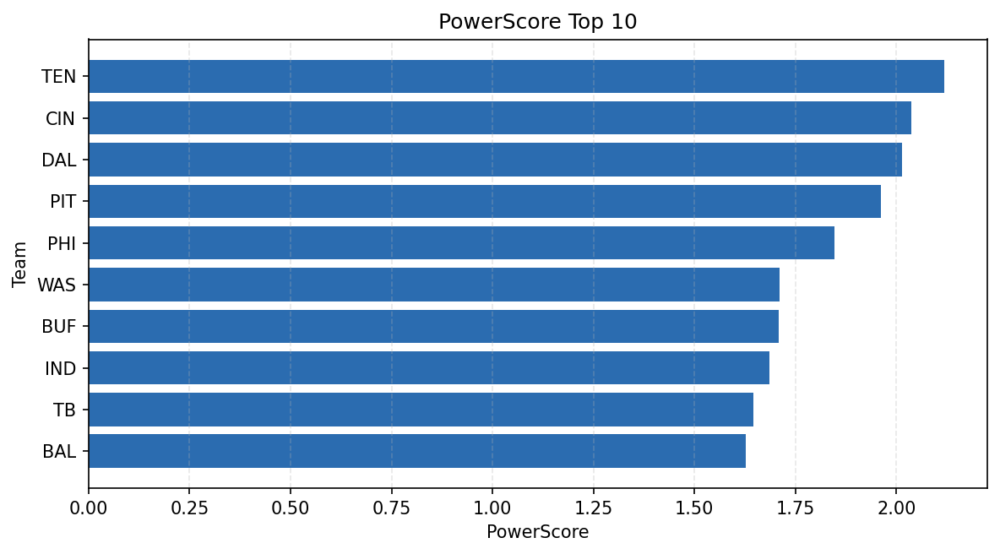

# Weekly Report - Season 2023, Week 9

_Generated at 2025-11-10T20:38:33.195368+00:00 (UTC)_

Data root: `data`

## Layer Shapes

| Layer | Artifact | Manifest | Rows | Columns | Status |
|-------|----------|----------|------|---------|--------|
| L1 Ingest | `data\l1\2023\9.parquet` | `data\l1\2023\9_manifest.json` | 2452 | 18 | ready |
| L2 Clean | `data\l2\2023\9.parquet` | `data\l2\2023\9_manifest.json` | 2452 | 24 | ready |
| L3 Team Week | `data\l3_team_week\2023\9.parquet` | `data\l3_team_week\2023\9_manifest.json` | 28 | 34 | ready |

## L2 Audit Snapshot

Last 3 entries from `data\l2_audit\2023\9_audit.jsonl`:

- {"step": "load", "details": "Loaded L1 parquet", "rows": 2452, "cols": 18, "timestamp": "2025-11-10T20:38:32.731884+00:00"}
- {"step": "prepare", "details": "Normalized team aliases, filtered season/week, deduplicated keys", "rows": 2452, "cols": 24, "rows_removed": 0, "timestamp": "2025-11-10T20:38:32.731884+00:00"}
- {"step": "validate", "details": "Validated against L2 contract and guardrails", "rows": 2452, "cols": 24, "timestamp": "2025-11-10T20:38:32.731884+00:00"}

## L3 Sanity

- Rows processed: 28
- Columns available: 34
- Artifact path: `data\l3_team_week\2023\9.parquet`

## Metrics Snapshot

### L4 Core12 Preview

- Artifact: `data\l4_core12\2023\9.parquet`
- Manifest: `data\l4_core12\2023\9_manifest.json`
- Rows: N/A
- Columns: N/A

| TEAM | core_epa_off | core_sr_off | core_sr_def |
| --- | --- | --- | --- |
| PHI | 0.20857632194680195 | 0.49382716049382713 | 0.4777777777777778 |
| TB | 0.1704907227393197 | 0.42528735632183906 | 0.4044943820224719 |
| BAL | 0.1569405955641152 | 0.5054945054945055 | 0.2463768115942029 |
| DAL | 0.1497894602517287 | 0.4777777777777778 | 0.49382716049382713 |
| HOU | 0.14771287990838625 | 0.4044943820224719 | 0.42528735632183906 |

### PowerScore Rankings

- Artifact: `data\l4_powerscore\2023\9.parquet`
- Manifest: `data\l4_powerscore\2023\9_manifest.json`
- Rows: 28
- Columns: 4

| team | power_score |
| --- | --- |
| PHI | 0.24370034547246713 |
| DAL | 0.23580824214413212 |
| TB | 0.220823524342738 |
| HOU | 0.2183819221787205 |
| PIT | 0.20284699161140118 |
| TEN | 0.18638810468456624 |
| BUF | 0.1731690494798343 |
| CIN | 0.17199116768612832 |
| WAS | 0.14703800927975827 |
| BAL | 0.13507493762708792 |

## Visualizations

