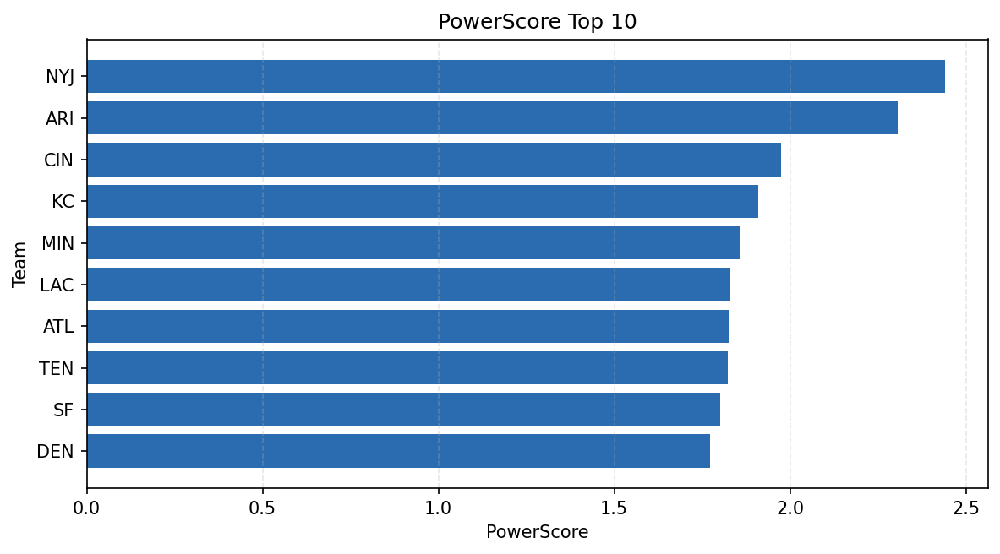

# Weekly Report - Season 2024, Week 10

_Generated at 2026-01-08T18:26:12.411030+00:00 (UTC)_

Data root: `data`

## Layer Shapes

| Layer | Artifact | Manifest | Rows | Columns | Status |
|-------|----------|----------|------|---------|--------|
| L1 Ingest | `data\l1\2024\10.parquet` | `data\l1\2024\10_manifest.json` | 2401 | 18 | ready |
| L2 Clean | `data\l2\2024\10.parquet` | `data\l2\2024\10_manifest.json` | 2401 | 24 | ready |
| L3 Team Week | `data\l3_team_week\2024\10.parquet` | `data\l3_team_week\2024\10_manifest.json` | 28 | 34 | ready |

## L2 Audit Snapshot

Last 3 entries from `data\l2_audit\2024\10_audit.jsonl`:

- {"step": "load", "details": "Loaded L1 parquet", "rows": 2401, "cols": 18, "timestamp": "2026-01-08T18:26:11.990936+00:00"}
- {"step": "prepare", "details": "Normalized team aliases, filtered season/week, deduplicated keys", "rows": 2401, "cols": 24, "rows_removed": 0, "timestamp": "2026-01-08T18:26:11.990936+00:00"}
- {"step": "validate", "details": "Validated against L2 contract and guardrails", "rows": 2401, "cols": 24, "timestamp": "2026-01-08T18:26:11.990936+00:00"}

## L3 Sanity

- Rows processed: 28
- Columns available: 34
- Artifact path: `data\l3_team_week\2024\10.parquet`

## Metrics Snapshot

### L4 Core12 Preview

- Artifact: `data\l4_core12\2024\10.parquet`
- Manifest: `data\l4_core12\2024\10_manifest.json`
- Rows: 28
- Columns: 27

| TEAM | core_epa_off | core_sr_off | core_sr_def |
| --- | --- | --- | --- |
| ARI | 0.3115161509615266 | 0.5972222222222222 | 0.5147058823529411 |
| BAL | 0.2034924989452631 | 0.5121951219512195 | 0.5208333333333334 |
| LAC | 0.1904974706496482 | 0.5205479452054794 | 0.5 |
| CIN | 0.16761503434584787 | 0.5208333333333334 | 0.5121951219512195 |
| SF | 0.13257224920671434 | 0.575 | 0.4936708860759494 |

### PowerScore Rankings

- Artifact: `data\l4_powerscore\2024\10.parquet`
- Manifest: `data\l4_powerscore\2024\10_manifest.json`
- Rows: 28
- Columns: 4

| team | power_score |
| --- | --- |
| NYJ | 2.440485054842734 |
| ARI | 2.3056726011895337 |
| CIN | 1.9750266405979782 |
| KC | 1.908975710183129 |
| MIN | 1.8552991509226415 |
| LAC | 1.8271665262938916 |
| ATL | 1.8259845022460186 |
| TEN | 1.821777043899489 |
| SF | 1.8018455402697349 |
| DEN | 1.77254169189907 |

## Visualizations

