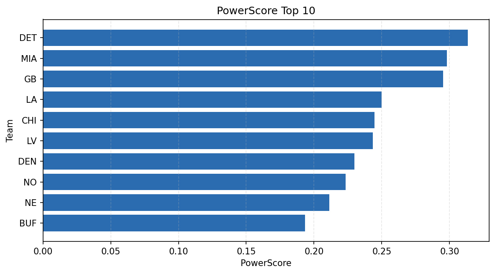

# Weekly Report - Season 2024, Week 11

_Generated at 2025-12-28T14:40:20.734563+00:00 (UTC)_

Data root: `data`

## Layer Shapes

| Layer | Artifact | Manifest | Rows | Columns | Status |
|-------|----------|----------|------|---------|--------|
| L1 Ingest | `data\l1\2024\11.parquet` | `data\l1\2024\11_manifest.json` | 2424 | 18 | ready |
| L2 Clean | `data\l2\2024\11.parquet` | `data\l2\2024\11_manifest.json` | 2424 | 24 | ready |
| L3 Team Week | `data\l3_team_week\2024\11.parquet` | `data\l3_team_week\2024\11_manifest.json` | 28 | 34 | ready |

## L2 Audit Snapshot

Last 3 entries from `data\l2_audit\2024\11_audit.jsonl`:

- {"step": "load", "details": "Loaded L1 parquet", "rows": 2424, "cols": 18, "timestamp": "2025-12-28T14:40:20.346141+00:00"}
- {"step": "prepare", "details": "Normalized team aliases, filtered season/week, deduplicated keys", "rows": 2424, "cols": 24, "rows_removed": 0, "timestamp": "2025-12-28T14:40:20.346141+00:00"}
- {"step": "validate", "details": "Validated against L2 contract and guardrails", "rows": 2424, "cols": 24, "timestamp": "2025-12-28T14:40:20.346141+00:00"}

## L3 Sanity

- Rows processed: 28
- Columns available: 34
- Artifact path: `data\l3_team_week\2024\11.parquet`

## Metrics Snapshot

### L4 Core12 Preview

- Artifact: `data\l4_core12\2024\11.parquet`
- Manifest: `data\l4_core12\2024\11_manifest.json`
- Rows: 28
- Columns: 27

| TEAM | core_epa_off | core_sr_off | core_sr_def |
| --- | --- | --- | --- |
| DET | 0.4393124011466685 | 0.6630434782608695 | 0.43283582089552236 |
| MIA | 0.31470053313050145 | 0.573170731707317 | 0.5063291139240507 |
| DEN | 0.28998482484664573 | 0.5526315789473685 | 0.42857142857142855 |
| GB | 0.26222136061239454 | 0.5357142857142857 | 0.4883720930232558 |
| NO | 0.21275800901993708 | 0.5135135135135135 | 0.3956043956043956 |

### PowerScore Rankings

- Artifact: `data\l4_powerscore\2024\11.parquet`
- Manifest: `data\l4_powerscore\2024\11_manifest.json`
- Rows: 28
- Columns: 4

| team | power_score |
| --- | --- |
| MIA | 2.6212993752038676 |
| LV | 2.490422877192355 |
| CHI | 2.371477123050087 |
| DET | 2.325299817615857 |
| NE | 2.303360992990152 |
| SEA | 1.9953255802475411 |
| BUF | 1.9330625660404563 |
| DEN | 1.8950368810524452 |
| SF | 1.8590753728308285 |
| GB | 1.8525288063125065 |

## Visualizations

