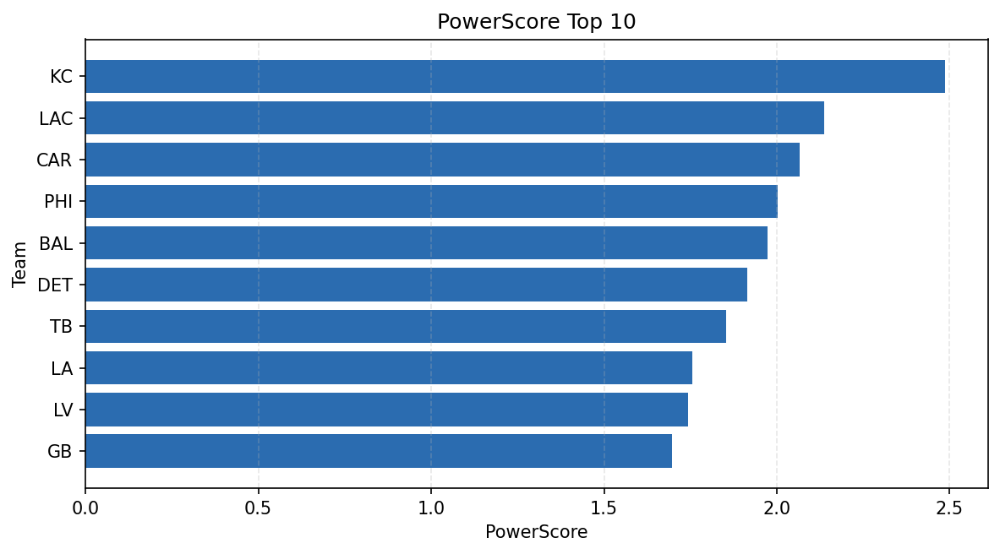

# Weekly Report - Season 2024, Week 12

_Generated at 2025-12-28T14:41:19.600677+00:00 (UTC)_

Data root: `data`

## Layer Shapes

| Layer | Artifact | Manifest | Rows | Columns | Status |
|-------|----------|----------|------|---------|--------|
| L1 Ingest | `data\l1\2024\12.parquet` | `data\l1\2024\12_manifest.json` | 2291 | 18 | ready |
| L2 Clean | `data\l2\2024\12.parquet` | `data\l2\2024\12_manifest.json` | 2291 | 24 | ready |
| L3 Team Week | `data\l3_team_week\2024\12.parquet` | `data\l3_team_week\2024\12_manifest.json` | 26 | 34 | ready |

## L2 Audit Snapshot

Last 3 entries from `data\l2_audit\2024\12_audit.jsonl`:

- {"step": "load", "details": "Loaded L1 parquet", "rows": 2291, "cols": 18, "timestamp": "2025-12-28T14:41:19.214051+00:00"}
- {"step": "prepare", "details": "Normalized team aliases, filtered season/week, deduplicated keys", "rows": 2291, "cols": 24, "rows_removed": 0, "timestamp": "2025-12-28T14:41:19.214051+00:00"}
- {"step": "validate", "details": "Validated against L2 contract and guardrails", "rows": 2291, "cols": 24, "timestamp": "2025-12-28T14:41:19.214051+00:00"}

## L3 Sanity

- Rows processed: 26
- Columns available: 34
- Artifact path: `data\l3_team_week\2024\12.parquet`

## Metrics Snapshot

### L4 Core12 Preview

- Artifact: `data\l4_core12\2024\12.parquet`
- Manifest: `data\l4_core12\2024\12_manifest.json`
- Rows: 26
- Columns: 27

| TEAM | core_epa_off | core_sr_off | core_sr_def |
| --- | --- | --- | --- |
| PHI | 0.2749450840212907 | 0.5168539325842697 | 0.5063291139240507 |
| KC | 0.244472243646526 | 0.5955056179775281 | 0.5060240963855421 |
| BAL | 0.22892420626940985 | 0.4810126582278481 | 0.5057471264367817 |
| TB | 0.21140016321288913 | 0.5 | 0.4246575342465753 |
| GB | 0.1462588829833061 | 0.5465116279069767 | 0.38235294117647056 |

### PowerScore Rankings

- Artifact: `data\l4_powerscore\2024\12.parquet`
- Manifest: `data\l4_powerscore\2024\12_manifest.json`
- Rows: 26
- Columns: 4

| team | power_score |
| --- | --- |
| KC | 2.4864893179080276 |
| LAC | 2.135808207522606 |
| CAR | 2.067178266510518 |
| PHI | 2.0025217269695768 |
| BAL | 1.9732197644932086 |
| DET | 1.9139461605099681 |
| TB | 1.8523862358208782 |
| LA | 1.756456858013371 |
| LV | 1.7432748996400973 |
| GB | 1.696431928422585 |

## Visualizations

