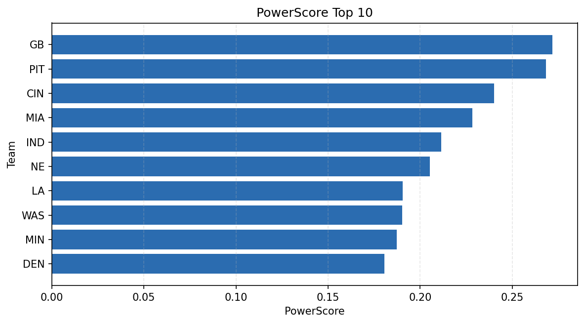

# Weekly Report - Season 2024, Week 13

_Generated at 2026-01-08T18:28:57.392229+00:00 (UTC)_

Data root: `data`

## Layer Shapes

| Layer | Artifact | Manifest | Rows | Columns | Status |
|-------|----------|----------|------|---------|--------|
| L1 Ingest | `data\l1\2024\13.parquet` | `data\l1\2024\13_manifest.json` | 2848 | 18 | ready |
| L2 Clean | `data\l2\2024\13.parquet` | `data\l2\2024\13_manifest.json` | 2848 | 24 | ready |
| L3 Team Week | `data\l3_team_week\2024\13.parquet` | `data\l3_team_week\2024\13_manifest.json` | 32 | 34 | ready |

## L2 Audit Snapshot

Last 3 entries from `data\l2_audit\2024\13_audit.jsonl`:

- {"step": "load", "details": "Loaded L1 parquet", "rows": 2848, "cols": 18, "timestamp": "2026-01-08T18:28:57.006001+00:00"}
- {"step": "prepare", "details": "Normalized team aliases, filtered season/week, deduplicated keys", "rows": 2848, "cols": 24, "rows_removed": 0, "timestamp": "2026-01-08T18:28:57.006001+00:00"}
- {"step": "validate", "details": "Validated against L2 contract and guardrails", "rows": 2848, "cols": 24, "timestamp": "2026-01-08T18:28:57.006001+00:00"}

## L3 Sanity

- Rows processed: 32
- Columns available: 34
- Artifact path: `data\l3_team_week\2024\13.parquet`

## Metrics Snapshot

### L4 Core12 Preview

- Artifact: `data\l4_core12\2024\13.parquet`
- Manifest: `data\l4_core12\2024\13_manifest.json`
- Rows: 32
- Columns: 27

| TEAM | core_epa_off | core_sr_off | core_sr_def |
| --- | --- | --- | --- |
| GB | 0.278299344677685 | 0.5138888888888888 | 0.5111111111111111 |
| PIT | 0.19026539296392803 | 0.6043956043956044 | 0.5783132530120482 |
| WAS | 0.14957151987755873 | 0.5742574257425742 | 0.3611111111111111 |
| BUF | 0.1430380254621721 | 0.5 | 0.35384615384615387 |
| IND | 0.11766690803641403 | 0.5675675675675675 | 0.5116279069767442 |

### PowerScore Rankings

- Artifact: `data\l4_powerscore\2024\13.parquet`
- Manifest: `data\l4_powerscore\2024\13_manifest.json`
- Rows: 32
- Columns: 4

| team | power_score |
| --- | --- |
| MIA | 2.2105793812958936 |
| ARI | 2.1975112751272503 |
| NO | 2.170925092283958 |
| DET | 2.014575301423485 |
| NE | 1.90210641437343 |
| ATL | 1.8912778045573546 |
| WAS | 1.8538985332284186 |
| IND | 1.845043214733059 |
| JAX | 1.8444433150739343 |
| PIT | 1.7521069591142016 |

## Visualizations

