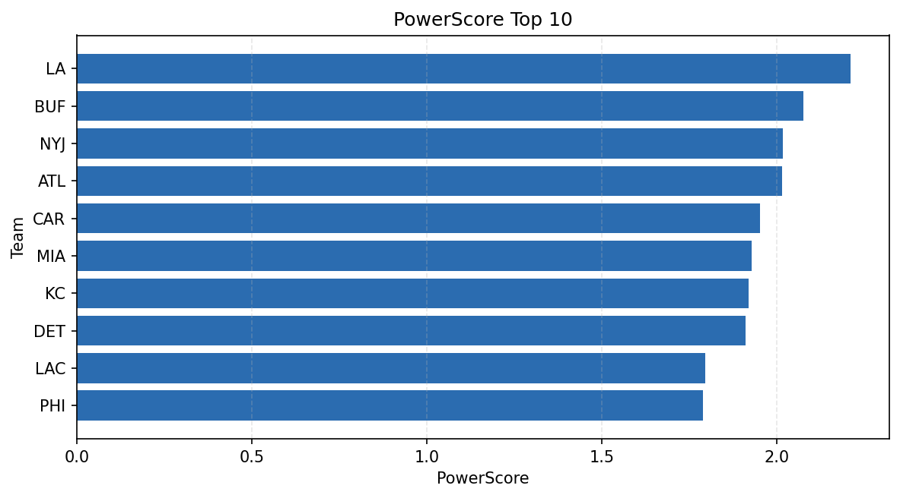

# Weekly Report - Season 2024, Week 14

_Generated at 2025-11-10T17:50:56.850899+00:00 (UTC)_

Data root: `data`

## Layer Shapes

| Layer | Artifact | Manifest | Rows | Columns | Status |
|-------|----------|----------|------|---------|--------|
| L1 Ingest | `data\l1\2024\14.parquet` | `data\l1\2024\14_manifest.json` | 2271 | 18 | ready |
| L2 Clean | `data\l2\2024\14.parquet` | `data\l2\2024\14_manifest.json` | 2271 | 24 | ready |
| L3 Team Week | `data\l3_team_week\2024\14.parquet` | `data\l3_team_week\2024\14_manifest.json` | 26 | 34 | ready |

## L2 Audit Snapshot

Last 3 entries from `data\l2_audit\2024\14_audit.jsonl`:

- {"step": "load", "details": "Loaded L1 parquet", "rows": 2271, "cols": 18, "timestamp": "2025-11-10T17:50:56.330363+00:00"}
- {"step": "prepare", "details": "Normalized team aliases, filtered season/week, deduplicated keys", "rows": 2271, "cols": 24, "rows_removed": 0, "timestamp": "2025-11-10T17:50:56.330363+00:00"}
- {"step": "validate", "details": "Validated against L2 contract and guardrails", "rows": 2271, "cols": 24, "timestamp": "2025-11-10T17:50:56.330363+00:00"}

## L3 Sanity

- Rows processed: 26
- Columns available: 34
- Artifact path: `data\l3_team_week\2024\14.parquet`

## Metrics Snapshot

### L4 Core12 Preview

- Artifact: `data\l4_core12\2024\14.parquet`
- Manifest: `data\l4_core12\2024\14_manifest.json`
- Rows: N/A
- Columns: N/A

| TEAM | core_epa_off | core_sr_off | core_sr_def |
| --- | --- | --- | --- |
| BUF | 0.308517160746851 | 0.55 | 0.5520833333333334 |
| SF | 0.30689824552746947 | 0.5064935064935064 | 0.47058823529411764 |
| MIN | 0.2903601813624487 | 0.5185185185185185 | 0.5494505494505495 |
| LA | 0.2587573437873895 | 0.5520833333333334 | 0.55 |
| MIA | 0.22263277060567185 | 0.6153846153846154 | 0.5681818181818182 |

### PowerScore Rankings

- Artifact: `data\l4_powerscore\2024\14.parquet`
- Manifest: `data\l4_powerscore\2024\14_manifest.json`
- Rows: 26
- Columns: 4

| team | power_score |
| --- | --- |
| BUF | 0.32723247501887576 |
| LA | 0.3173726691416232 |
| MIA | 0.28542548382752947 |
| NYJ | 0.27785088651564455 |
| MIN | 0.26590806453304544 |
| SF | 0.24903072587718134 |
| ATL | 0.22415392504253984 |
| CIN | 0.20229746440896845 |
| DET | 0.2007186644925565 |
| GB | 0.19901752066409925 |

## Visualizations

