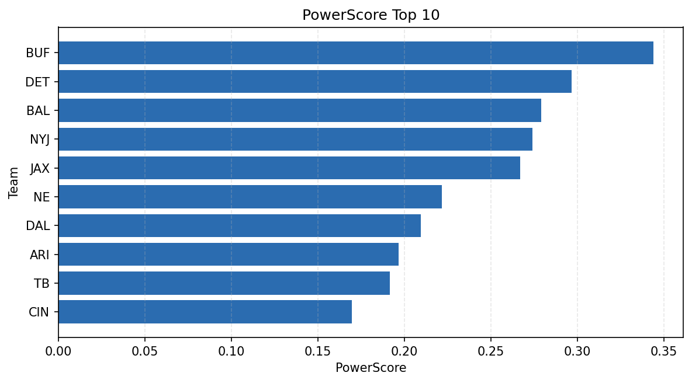

# Weekly Report - Season 2024, Week 15

_Generated at 2026-01-08T18:31:00.570396+00:00 (UTC)_

Data root: `data`

## Layer Shapes

| Layer | Artifact | Manifest | Rows | Columns | Status |
|-------|----------|----------|------|---------|--------|
| L1 Ingest | `data\l1\2024\15.parquet` | `data\l1\2024\15_manifest.json` | 2780 | 18 | ready |
| L2 Clean | `data\l2\2024\15.parquet` | `data\l2\2024\15_manifest.json` | 2780 | 24 | ready |
| L3 Team Week | `data\l3_team_week\2024\15.parquet` | `data\l3_team_week\2024\15_manifest.json` | 32 | 34 | ready |

## L2 Audit Snapshot

Last 3 entries from `data\l2_audit\2024\15_audit.jsonl`:

- {"step": "load", "details": "Loaded L1 parquet", "rows": 2780, "cols": 18, "timestamp": "2026-01-08T18:31:00.136777+00:00"}
- {"step": "prepare", "details": "Normalized team aliases, filtered season/week, deduplicated keys", "rows": 2780, "cols": 24, "rows_removed": 0, "timestamp": "2026-01-08T18:31:00.136777+00:00"}
- {"step": "validate", "details": "Validated against L2 contract and guardrails", "rows": 2780, "cols": 24, "timestamp": "2026-01-08T18:31:00.136777+00:00"}

## L3 Sanity

- Rows processed: 32
- Columns available: 34
- Artifact path: `data\l3_team_week\2024\15.parquet`

## Metrics Snapshot

### L4 Core12 Preview

- Artifact: `data\l4_core12\2024\15.parquet`
- Manifest: `data\l4_core12\2024\15_manifest.json`
- Rows: 32
- Columns: 27

| TEAM | core_epa_off | core_sr_off | core_sr_def |
| --- | --- | --- | --- |
| BUF | 0.3606015303591778 | 0.5934065934065934 | 0.5454545454545454 |
| BAL | 0.3064228371104659 | 0.5753424657534246 | 0.40476190476190477 |
| NYJ | 0.2914564291668403 | 0.45454545454545453 | 0.5773195876288659 |
| TB | 0.19357375647916003 | 0.5697674418604651 | 0.45714285714285713 |
| DET | 0.18292920374208027 | 0.5454545454545454 | 0.5934065934065934 |

### PowerScore Rankings

- Artifact: `data\l4_powerscore\2024\15.parquet`
- Manifest: `data\l4_powerscore\2024\15_manifest.json`
- Rows: 32
- Columns: 4

| team | power_score |
| --- | --- |
| PHI | 2.251626791217505 |
| WAS | 2.2261746257046795 |
| JAX | 2.1904744499207034 |
| DET | 2.0725091637452002 |
| ARI | 2.0490628750079685 |
| NYG | 2.015805464320116 |
| MIN | 2.0139693646700745 |
| CIN | 1.9497726947812783 |
| BAL | 1.8656851196726014 |
| BUF | 1.8278146913924431 |

## Visualizations

