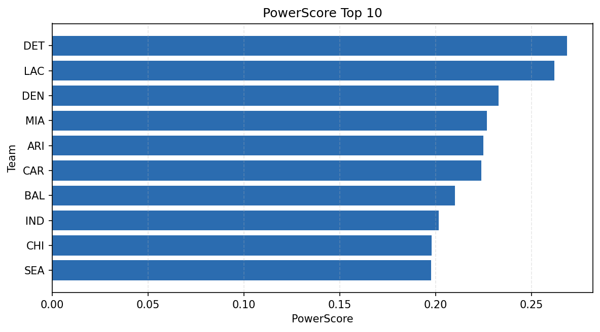

# Weekly Report - Season 2024, Week 16

_Generated at 2025-12-28T14:52:11.929876+00:00 (UTC)_

Data root: `data`

## Layer Shapes

| Layer | Artifact | Manifest | Rows | Columns | Status |
|-------|----------|----------|------|---------|--------|
| L1 Ingest | `data\l1\2024\16.parquet` | `data\l1\2024\16_manifest.json` | 2764 | 18 | ready |
| L2 Clean | `data\l2\2024\16.parquet` | `data\l2\2024\16_manifest.json` | 2764 | 24 | ready |
| L3 Team Week | `data\l3_team_week\2024\16.parquet` | `data\l3_team_week\2024\16_manifest.json` | 32 | 34 | ready |

## L2 Audit Snapshot

Last 3 entries from `data\l2_audit\2024\16_audit.jsonl`:

- {"step": "load", "details": "Loaded L1 parquet", "rows": 2764, "cols": 18, "timestamp": "2025-12-28T14:52:11.519188+00:00"}
- {"step": "prepare", "details": "Normalized team aliases, filtered season/week, deduplicated keys", "rows": 2764, "cols": 24, "rows_removed": 0, "timestamp": "2025-12-28T14:52:11.519188+00:00"}
- {"step": "validate", "details": "Validated against L2 contract and guardrails", "rows": 2764, "cols": 24, "timestamp": "2025-12-28T14:52:11.519188+00:00"}

## L3 Sanity

- Rows processed: 32
- Columns available: 34
- Artifact path: `data\l3_team_week\2024\16.parquet`

## Metrics Snapshot

### L4 Core12 Preview

- Artifact: `data\l4_core12\2024\16.parquet`
- Manifest: `data\l4_core12\2024\16_manifest.json`
- Rows: 32
- Columns: 27

| TEAM | core_epa_off | core_sr_off | core_sr_def |
| --- | --- | --- | --- |
| DET | 0.2762668057367569 | 0.573170731707317 | 0.46987951807228917 |
| GB | 0.2464010525823516 | 0.5058823529411764 | 0.35714285714285715 |
| LAC | 0.2093985794503012 | 0.5308641975308642 | 0.4939759036144578 |
| MIA | 0.1945277580784427 | 0.5679012345679012 | 0.5058823529411764 |
| CAR | 0.17573967646393512 | 0.45555555555555555 | 0.5111111111111111 |

### PowerScore Rankings

- Artifact: `data\l4_powerscore\2024\16.parquet`
- Manifest: `data\l4_powerscore\2024\16_manifest.json`
- Rows: 32
- Columns: 4

| team | power_score |
| --- | --- |
| NYJ | 2.340635707850156 |
| KC | 2.107712611749153 |
| GB | 2.0479022674299134 |
| CHI | 2.016023553080558 |
| NE | 1.9756344605614962 |
| DET | 1.8793322752036596 |
| DEN | 1.8759299790955362 |
| SF | 1.8688144976954932 |
| ARI | 1.8411903709850765 |
| HOU | 1.8142017360806426 |

## Visualizations

