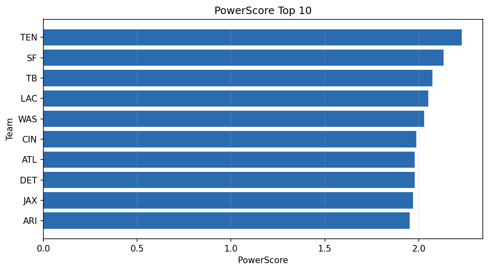

# Weekly Report - Season 2024, Week 17

_Generated at 2025-11-10T17:51:30.844652+00:00 (UTC)_

Data root: `data`

## Layer Shapes

| Layer | Artifact | Manifest | Rows | Columns | Status |
|-------|----------|----------|------|---------|--------|
| L1 Ingest | `data\l1\2024\17.parquet` | `data\l1\2024\17_manifest.json` | 2766 | 18 | ready |
| L2 Clean | `data\l2\2024\17.parquet` | `data\l2\2024\17_manifest.json` | 2766 | 24 | ready |
| L3 Team Week | `data\l3_team_week\2024\17.parquet` | `data\l3_team_week\2024\17_manifest.json` | 32 | 34 | ready |

## L2 Audit Snapshot

Last 3 entries from `data\l2_audit\2024\17_audit.jsonl`:

- {"step": "load", "details": "Loaded L1 parquet", "rows": 2766, "cols": 18, "timestamp": "2025-11-10T17:51:30.328619+00:00"}
- {"step": "prepare", "details": "Normalized team aliases, filtered season/week, deduplicated keys", "rows": 2766, "cols": 24, "rows_removed": 0, "timestamp": "2025-11-10T17:51:30.328619+00:00"}
- {"step": "validate", "details": "Validated against L2 contract and guardrails", "rows": 2766, "cols": 24, "timestamp": "2025-11-10T17:51:30.328619+00:00"}

## L3 Sanity

- Rows processed: 32
- Columns available: 34
- Artifact path: `data\l3_team_week\2024\17.parquet`

## Metrics Snapshot

### L4 Core12 Preview

- Artifact: `data\l4_core12\2024\17.parquet`
- Manifest: `data\l4_core12\2024\17_manifest.json`
- Rows: N/A
- Columns: N/A

| TEAM | core_epa_off | core_sr_off | core_sr_def |
| --- | --- | --- | --- |
| DET | 0.33518200608280796 | 0.5595238095238095 | 0.6024096385542169 |
| TB | 0.3160432892770547 | 0.5978260869565217 | 0.47761194029850745 |
| BAL | 0.256203593170013 | 0.5657894736842105 | 0.38028169014084506 |
| NYG | 0.2554120985524995 | 0.4675324675324675 | 0.5425531914893617 |
| LAC | 0.24965342161978812 | 0.5531914893617021 | 0.45588235294117646 |

### PowerScore Rankings

- Artifact: `data\l4_powerscore\2024\17.parquet`
- Manifest: `data\l4_powerscore\2024\17_manifest.json`
- Rows: 32
- Columns: 4

| team | power_score |
| --- | --- |
| DET | 0.3189710680925211 |
| SF | 0.31234392016680995 |
| TB | 0.27311098349426005 |
| NYG | 0.24725150412095764 |
| IND | 0.22999221602685488 |
| CIN | 0.2232338202683818 |
| ATL | 0.22161099959601704 |
| WAS | 0.21151010618365307 |
| DEN | 0.20420435270807138 |
| BAL | 0.2009773925947825 |

## Visualizations

