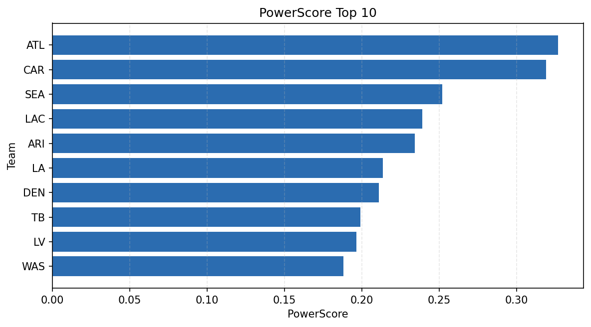

# Weekly Report - Season 2024, Week 18

_Generated at 2025-11-10T17:51:41.998751+00:00 (UTC)_

Data root: `data`

## Layer Shapes

| Layer | Artifact | Manifest | Rows | Columns | Status |
|-------|----------|----------|------|---------|--------|
| L1 Ingest | `data\l1\2024\18.parquet` | `data\l1\2024\18_manifest.json` | 2784 | 18 | ready |
| L2 Clean | `data\l2\2024\18.parquet` | `data\l2\2024\18_manifest.json` | 2784 | 24 | ready |
| L3 Team Week | `data\l3_team_week\2024\18.parquet` | `data\l3_team_week\2024\18_manifest.json` | 32 | 34 | ready |

## L2 Audit Snapshot

Last 3 entries from `data\l2_audit\2024\18_audit.jsonl`:

- {"step": "load", "details": "Loaded L1 parquet", "rows": 2784, "cols": 18, "timestamp": "2025-11-10T17:51:41.494081+00:00"}
- {"step": "prepare", "details": "Normalized team aliases, filtered season/week, deduplicated keys", "rows": 2784, "cols": 24, "rows_removed": 0, "timestamp": "2025-11-10T17:51:41.494081+00:00"}
- {"step": "validate", "details": "Validated against L2 contract and guardrails", "rows": 2784, "cols": 24, "timestamp": "2025-11-10T17:51:41.494081+00:00"}

## L3 Sanity

- Rows processed: 32
- Columns available: 34
- Artifact path: `data\l3_team_week\2024\18.parquet`

## Metrics Snapshot

### L4 Core12 Preview

- Artifact: `data\l4_core12\2024\18.parquet`
- Manifest: `data\l4_core12\2024\18_manifest.json`
- Rows: N/A
- Columns: N/A

| TEAM | core_epa_off | core_sr_off | core_sr_def |
| --- | --- | --- | --- |
| CAR | 0.3302383454845232 | 0.5529411764705883 | 0.6354166666666666 |
| DEN | 0.3148762954762955 | 0.5632183908045977 | 0.3 |
| ARI | 0.24702111475689467 | 0.5697674418604651 | 0.48936170212765956 |
| LAC | 0.21026955797594596 | 0.5531914893617021 | 0.5223880597014925 |
| ATL | 0.19645322432916146 | 0.6354166666666666 | 0.5529411764705883 |

### PowerScore Rankings

- Artifact: `data\l4_powerscore\2024\18.parquet`
- Manifest: `data\l4_powerscore\2024\18_manifest.json`
- Rows: 32
- Columns: 4

| team | power_score |
| --- | --- |
| ATL | 0.3269937976121111 |
| CAR | 0.31899171284423894 |
| SEA | 0.25202350879621827 |
| LAC | 0.2391788287021361 |
| ARI | 0.23417409736025324 |
| LA | 0.21355230175536155 |
| DEN | 0.21089476877232566 |
| TB | 0.19894648004218474 |
| LV | 0.19661716721751885 |
| WAS | 0.18810703967849873 |

## Visualizations

