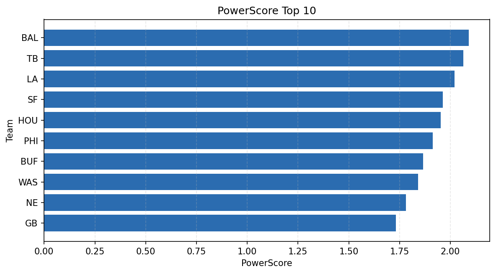

# Weekly Report - Season 2024, Week 1

_Generated at 2026-01-08T18:19:55.466977+00:00 (UTC)_

Data root: `data`

## Layer Shapes

| Layer | Artifact | Manifest | Rows | Columns | Status |
|-------|----------|----------|------|---------|--------|
| L1 Ingest | `data\l1\2024\1.parquet` | `data\l1\2024\1_manifest.json` | 2740 | 18 | ready |
| L2 Clean | `data\l2\2024\1.parquet` | `data\l2\2024\1_manifest.json` | 2740 | 24 | ready |
| L3 Team Week | `data\l3_team_week\2024\1.parquet` | `data\l3_team_week\2024\1_manifest.json` | 32 | 34 | ready |

## L2 Audit Snapshot

Last 3 entries from `data\l2_audit\2024\1_audit.jsonl`:

- {"step": "load", "details": "Loaded L1 parquet", "rows": 2740, "cols": 18, "timestamp": "2026-01-08T18:19:55.094818+00:00"}
- {"step": "prepare", "details": "Normalized team aliases, filtered season/week, deduplicated keys", "rows": 2740, "cols": 24, "rows_removed": 0, "timestamp": "2026-01-08T18:19:55.094818+00:00"}
- {"step": "validate", "details": "Validated against L2 contract and guardrails", "rows": 2740, "cols": 24, "timestamp": "2026-01-08T18:19:55.094818+00:00"}

## L3 Sanity

- Rows processed: 32
- Columns available: 34
- Artifact path: `data\l3_team_week\2024\1.parquet`

## Metrics Snapshot

### L4 Core12 Preview

- Artifact: `data\l4_core12\2024\1.parquet`
- Manifest: `data\l4_core12\2024\1_manifest.json`
- Rows: 32
- Columns: 27

| TEAM | core_epa_off | core_sr_off | core_sr_def |
| --- | --- | --- | --- |
| TB | 0.2696233763836506 | 0.5487804878048781 | 0.5 |
| NO | 0.19670652924680415 | 0.49382716049382713 | 0.379746835443038 |
| BUF | 0.18899499383513574 | 0.6049382716049383 | 0.4473684210526316 |
| SF | 0.17194769292902412 | 0.4943820224719101 | 0.484375 |
| ARI | 0.14116282890991946 | 0.4473684210526316 | 0.6049382716049383 |

### PowerScore Rankings

- Artifact: `data\l4_powerscore\2024\1.parquet`
- Manifest: `data\l4_powerscore\2024\1_manifest.json`
- Rows: 32
- Columns: 4

| team | power_score |
| --- | --- |
| BAL | 2.090060327252556 |
| TB | 2.0641185567610894 |
| LA | 2.020598721617278 |
| SF | 1.9632528618514262 |
| HOU | 1.9530671069222267 |
| PHI | 1.9132129581016084 |
| BUF | 1.865615381525516 |
| WAS | 1.8414519237145723 |
| NE | 1.7811603264706317 |
| GB | 1.732318679297179 |

## Visualizations

