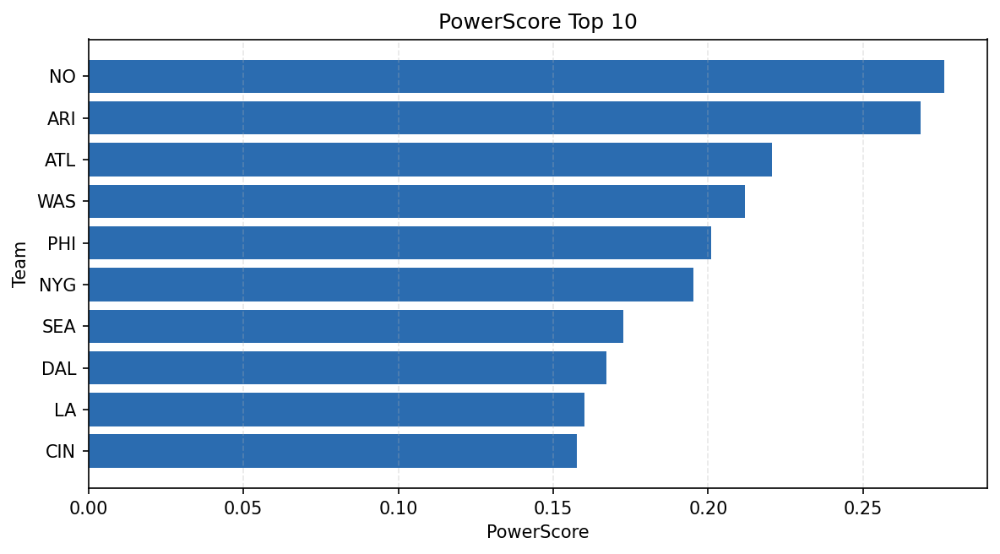

# Weekly Report - Season 2024, Week 2

_Generated at 2025-12-28T14:13:27.946917+00:00 (UTC)_

Data root: `data`

## Layer Shapes

| Layer | Artifact | Manifest | Rows | Columns | Status |
|-------|----------|----------|------|---------|--------|
| L1 Ingest | `data\l1\2024\2.parquet` | `data\l1\2024\2_manifest.json` | 2721 | 18 | ready |
| L2 Clean | `data\l2\2024\2.parquet` | `data\l2\2024\2_manifest.json` | 2721 | 24 | ready |
| L3 Team Week | `data\l3_team_week\2024\2.parquet` | `data\l3_team_week\2024\2_manifest.json` | 32 | 34 | ready |

## L2 Audit Snapshot

Last 3 entries from `data\l2_audit\2024\2_audit.jsonl`:

- {"step": "load", "details": "Loaded L1 parquet", "rows": 2721, "cols": 18, "timestamp": "2025-12-28T14:13:27.553275+00:00"}
- {"step": "prepare", "details": "Normalized team aliases, filtered season/week, deduplicated keys", "rows": 2721, "cols": 24, "rows_removed": 0, "timestamp": "2025-12-28T14:13:27.553275+00:00"}
- {"step": "validate", "details": "Validated against L2 contract and guardrails", "rows": 2721, "cols": 24, "timestamp": "2025-12-28T14:13:27.553275+00:00"}

## L3 Sanity

- Rows processed: 32
- Columns available: 34
- Artifact path: `data\l3_team_week\2024\2.parquet`

## Metrics Snapshot

### L4 Core12 Preview

- Artifact: `data\l4_core12\2024\2.parquet`
- Manifest: `data\l4_core12\2024\2_manifest.json`
- Rows: 32
- Columns: 27

| TEAM | core_epa_off | core_sr_off | core_sr_def |
| --- | --- | --- | --- |
| NO | 0.3328928588698172 | 0.589041095890411 | 0.45977011494252873 |
| ARI | 0.3216522908260231 | 0.5875 | 0.5223880597014925 |
| ATL | 0.1376739255171521 | 0.5 | 0.47674418604651164 |
| WAS | 0.13138500058816538 | 0.4666666666666667 | 0.45588235294117646 |
| BUF | 0.1114574812474798 | 0.4098360655737705 | 0.47191011235955055 |

### PowerScore Rankings

- Artifact: `data\l4_powerscore\2024\2.parquet`
- Manifest: `data\l4_powerscore\2024\2_manifest.json`
- Rows: 32
- Columns: 4

| team | power_score |
| --- | --- |
| WAS | 2.1806224233082503 |
| NYG | 2.11455399247259 |
| PHI | 2.0888529197082275 |
| CLE | 2.0762915438153 |
| ARI | 2.008814331644558 |
| DET | 1.8984403108350765 |
| DAL | 1.8955597100914559 |
| MIA | 1.8378352710273311 |
| ATL | 1.8353565909366234 |
| SF | 1.7664113574211375 |

## Visualizations

