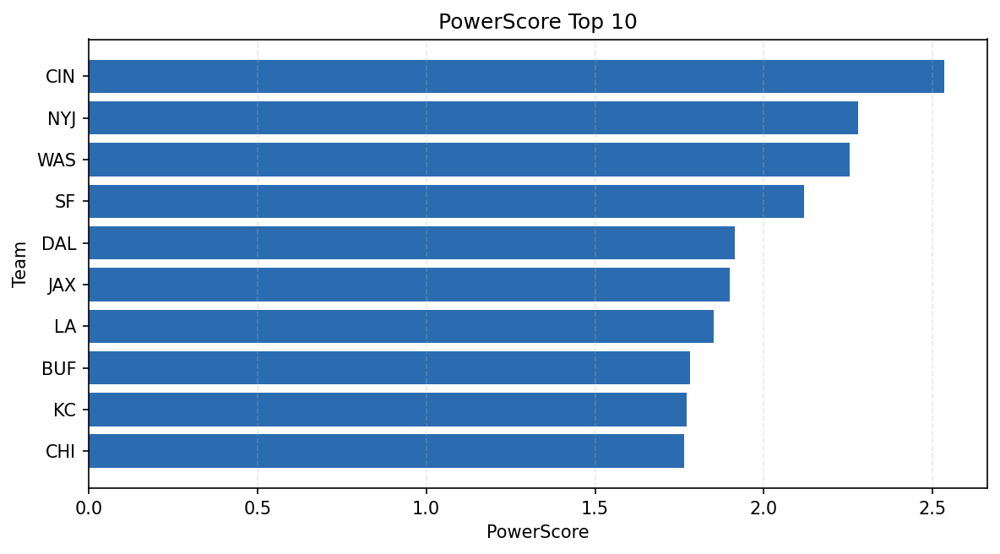

# Weekly Report - Season 2024, Week 3

_Generated at 2025-12-28T14:19:42.448634+00:00 (UTC)_

Data root: `data`

## Layer Shapes

| Layer | Artifact | Manifest | Rows | Columns | Status |
|-------|----------|----------|------|---------|--------|
| L1 Ingest | `data\l1\2024\3.parquet` | `data\l1\2024\3_manifest.json` | 2732 | 18 | ready |
| L2 Clean | `data\l2\2024\3.parquet` | `data\l2\2024\3_manifest.json` | 2732 | 24 | ready |
| L3 Team Week | `data\l3_team_week\2024\3.parquet` | `data\l3_team_week\2024\3_manifest.json` | 32 | 34 | ready |

## L2 Audit Snapshot

Last 3 entries from `data\l2_audit\2024\3_audit.jsonl`:

- {"step": "load", "details": "Loaded L1 parquet", "rows": 2732, "cols": 18, "timestamp": "2025-12-28T14:19:42.057919+00:00"}
- {"step": "prepare", "details": "Normalized team aliases, filtered season/week, deduplicated keys", "rows": 2732, "cols": 24, "rows_removed": 0, "timestamp": "2025-12-28T14:19:42.057919+00:00"}
- {"step": "validate", "details": "Validated against L2 contract and guardrails", "rows": 2732, "cols": 24, "timestamp": "2025-12-28T14:19:42.057919+00:00"}

## L3 Sanity

- Rows processed: 32
- Columns available: 34
- Artifact path: `data\l3_team_week\2024\3.parquet`

## Metrics Snapshot

### L4 Core12 Preview

- Artifact: `data\l4_core12\2024\3.parquet`
- Manifest: `data\l4_core12\2024\3_manifest.json`
- Rows: 32
- Columns: 27

| TEAM | core_epa_off | core_sr_off | core_sr_def |
| --- | --- | --- | --- |
| WAS | 0.42018503157765064 | 0.5921052631578947 | 0.5844155844155844 |
| BUF | 0.3415094192426365 | 0.5384615384615384 | 0.42696629213483145 |
| CIN | 0.3002589874017935 | 0.5844155844155844 | 0.5921052631578947 |
| CAR | 0.16144289004225884 | 0.5161290322580645 | 0.525 |
| LA | 0.15919995061247735 | 0.5 | 0.5116279069767442 |

### PowerScore Rankings

- Artifact: `data\l4_powerscore\2024\3.parquet`
- Manifest: `data\l4_powerscore\2024\3_manifest.json`
- Rows: 32
- Columns: 4

| team | power_score |
| --- | --- |
| CIN | 2.5352315480100542 |
| NYJ | 2.2795607741886013 |
| WAS | 2.25514287432201 |
| SF | 2.1182356443564645 |
| DAL | 1.9134863389770185 |
| JAX | 1.898127730341115 |
| LA | 1.8522373222323383 |
| BUF | 1.7816204090410959 |
| KC | 1.7704510680456025 |
| CHI | 1.7640201636566681 |

## Visualizations

