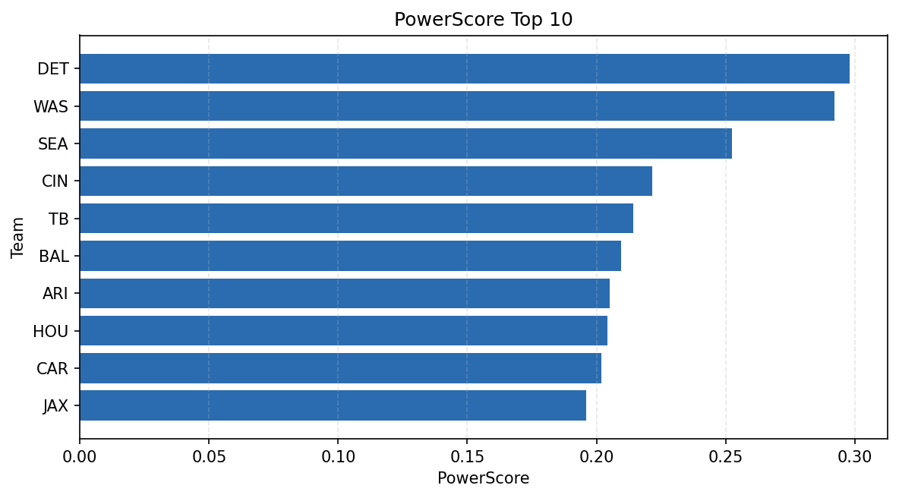

# Weekly Report - Season 2024, Week 4

_Generated at 2025-11-10T17:49:05.059365+00:00 (UTC)_

Data root: `data`

## Layer Shapes

| Layer | Artifact | Manifest | Rows | Columns | Status |
|-------|----------|----------|------|---------|--------|
| L1 Ingest | `data\l1\2024\4.parquet` | `data\l1\2024\4_manifest.json` | 2748 | 18 | ready |
| L2 Clean | `data\l2\2024\4.parquet` | `data\l2\2024\4_manifest.json` | 2748 | 24 | ready |
| L3 Team Week | `data\l3_team_week\2024\4.parquet` | `data\l3_team_week\2024\4_manifest.json` | 32 | 34 | ready |

## L2 Audit Snapshot

Last 3 entries from `data\l2_audit\2024\4_audit.jsonl`:

- {"step": "load", "details": "Loaded L1 parquet", "rows": 2748, "cols": 18, "timestamp": "2025-11-10T17:49:04.449400+00:00"}
- {"step": "prepare", "details": "Normalized team aliases, filtered season/week, deduplicated keys", "rows": 2748, "cols": 24, "rows_removed": 0, "timestamp": "2025-11-10T17:49:04.449400+00:00"}
- {"step": "validate", "details": "Validated against L2 contract and guardrails", "rows": 2748, "cols": 24, "timestamp": "2025-11-10T17:49:04.449400+00:00"}

## L3 Sanity

- Rows processed: 32
- Columns available: 34
- Artifact path: `data\l3_team_week\2024\4.parquet`

## Metrics Snapshot

### L4 Core12 Preview

- Artifact: `data\l4_core12\2024\4.parquet`
- Manifest: `data\l4_core12\2024\4_manifest.json`
- Rows: N/A
- Columns: N/A

| TEAM | core_epa_off | core_sr_off | core_sr_def |
| --- | --- | --- | --- |
| WAS | 0.37383902014144477 | 0.6071428571428571 | 0.5068493150684932 |
| DET | 0.3269782485946527 | 0.5652173913043478 | 0.5233644859813084 |
| BAL | 0.2083340742521816 | 0.5416666666666666 | 0.38961038961038963 |
| CIN | 0.20065689029688216 | 0.4939759036144578 | 0.5227272727272727 |
| TB | 0.18697235084285863 | 0.5052631578947369 | 0.4861111111111111 |

### PowerScore Rankings

- Artifact: `data\l4_powerscore\2024\4.parquet`
- Manifest: `data\l4_powerscore\2024\4_manifest.json`
- Rows: 32
- Columns: 4

| team | power_score |
| --- | --- |
| DET | 0.2979523130106586 |
| WAS | 0.292124845545998 |
| SEA | 0.2524817422875599 |
| CIN | 0.22170229127306657 |
| TB | 0.21438021876669505 |
| BAL | 0.20963039548495113 |
| ARI | 0.20525474691084927 |
| HOU | 0.20423192228595322 |
| CAR | 0.2019495539809502 |
| JAX | 0.19614637396219264 |

## Visualizations

