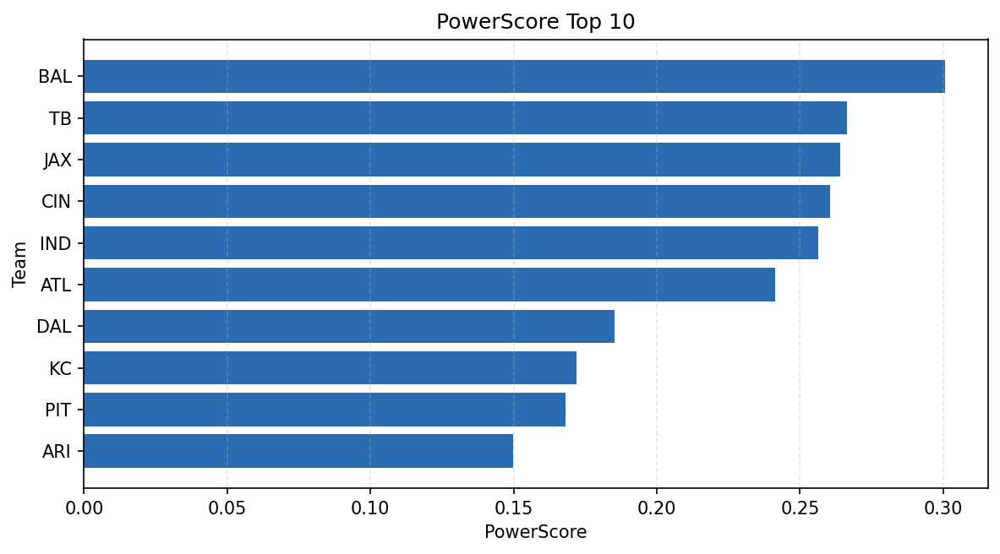

# Weekly Report - Season 2024, Week 5

_Generated at 2025-11-10T17:49:17.052601+00:00 (UTC)_

Data root: `data`

## Layer Shapes

| Layer | Artifact | Manifest | Rows | Columns | Status |
|-------|----------|----------|------|---------|--------|
| L1 Ingest | `data\l1\2024\5.parquet` | `data\l1\2024\5_manifest.json` | 2522 | 18 | ready |
| L2 Clean | `data\l2\2024\5.parquet` | `data\l2\2024\5_manifest.json` | 2522 | 24 | ready |
| L3 Team Week | `data\l3_team_week\2024\5.parquet` | `data\l3_team_week\2024\5_manifest.json` | 28 | 34 | ready |

## L2 Audit Snapshot

Last 3 entries from `data\l2_audit\2024\5_audit.jsonl`:

- {"step": "load", "details": "Loaded L1 parquet", "rows": 2522, "cols": 18, "timestamp": "2025-11-10T17:49:16.427983+00:00"}
- {"step": "prepare", "details": "Normalized team aliases, filtered season/week, deduplicated keys", "rows": 2522, "cols": 24, "rows_removed": 0, "timestamp": "2025-11-10T17:49:16.427983+00:00"}
- {"step": "validate", "details": "Validated against L2 contract and guardrails", "rows": 2522, "cols": 24, "timestamp": "2025-11-10T17:49:16.427983+00:00"}

## L3 Sanity

- Rows processed: 28
- Columns available: 34
- Artifact path: `data\l3_team_week\2024\5.parquet`

## Metrics Snapshot

### L4 Core12 Preview

- Artifact: `data\l4_core12\2024\5.parquet`
- Manifest: `data\l4_core12\2024\5_manifest.json`
- Rows: N/A
- Columns: N/A

| TEAM | core_epa_off | core_sr_off | core_sr_def |
| --- | --- | --- | --- |
| BAL | 0.25153988001770095 | 0.5894736842105263 | 0.4891304347826087 |
| JAX | 0.23499713759673269 | 0.5263157894736842 | 0.4946236559139785 |
| TB | 0.20195647701621056 | 0.5522388059701493 | 0.5 |
| CIN | 0.1892393207906381 | 0.4891304347826087 | 0.5894736842105263 |
| IND | 0.17155197020419824 | 0.4946236559139785 | 0.5263157894736842 |

### PowerScore Rankings

- Artifact: `data\l4_powerscore\2024\5.parquet`
- Manifest: `data\l4_powerscore\2024\5_manifest.json`
- Rows: 28
- Columns: 4

| team | power_score |
| --- | --- |
| BAL | 0.3006236642695861 |
| TB | 0.26644672472414077 |
| JAX | 0.26392781325232767 |
| CIN | 0.2605634774106983 |
| IND | 0.2565049826822138 |
| ATL | 0.24140416518869728 |
| DAL | 0.18527041740732453 |
| KC | 0.17201606717680093 |
| PIT | 0.16803929841824145 |
| ARI | 0.14986984107446621 |

## Visualizations

