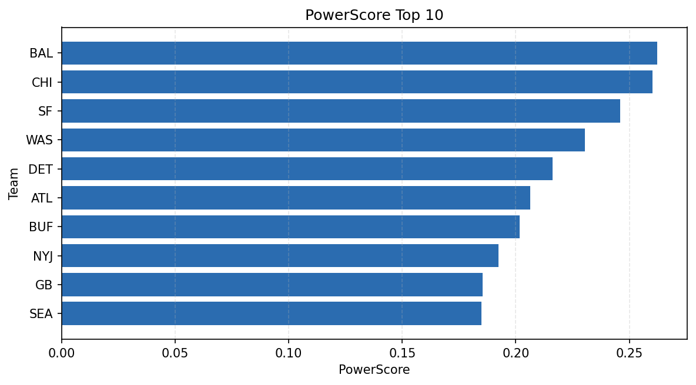

# Weekly Report - Season 2024, Week 6

_Generated at 2026-01-08T18:23:03.116681+00:00 (UTC)_

Data root: `data`

## Layer Shapes

| Layer | Artifact | Manifest | Rows | Columns | Status |
|-------|----------|----------|------|---------|--------|
| L1 Ingest | `data\l1\2024\6.parquet` | `data\l1\2024\6_manifest.json` | 2450 | 18 | ready |
| L2 Clean | `data\l2\2024\6.parquet` | `data\l2\2024\6_manifest.json` | 2450 | 24 | ready |
| L3 Team Week | `data\l3_team_week\2024\6.parquet` | `data\l3_team_week\2024\6_manifest.json` | 28 | 34 | ready |

## L2 Audit Snapshot

Last 3 entries from `data\l2_audit\2024\6_audit.jsonl`:

- {"step": "load", "details": "Loaded L1 parquet", "rows": 2450, "cols": 18, "timestamp": "2026-01-08T18:23:02.438177+00:00"}
- {"step": "prepare", "details": "Normalized team aliases, filtered season/week, deduplicated keys", "rows": 2450, "cols": 24, "rows_removed": 0, "timestamp": "2026-01-08T18:23:02.438177+00:00"}
- {"step": "validate", "details": "Validated against L2 contract and guardrails", "rows": 2450, "cols": 24, "timestamp": "2026-01-08T18:23:02.438177+00:00"}

## L3 Sanity

- Rows processed: 28
- Columns available: 34
- Artifact path: `data\l3_team_week\2024\6.parquet`

## Metrics Snapshot

### L4 Core12 Preview

- Artifact: `data\l4_core12\2024\6.parquet`
- Manifest: `data\l4_core12\2024\6_manifest.json`
- Rows: 28
- Columns: 27

| TEAM | core_epa_off | core_sr_off | core_sr_def |
| --- | --- | --- | --- |
| DET | 0.2974708306408206 | 0.5 | 0.43529411764705883 |
| CHI | 0.26703515979461373 | 0.5375 | 0.4358974358974359 |
| SF | 0.25443719798721465 | 0.5180722891566265 | 0.4536082474226804 |
| ATL | 0.19900853200310684 | 0.5301204819277109 | 0.45348837209302323 |
| BAL | 0.18287929114220397 | 0.5357142857142857 | 0.5128205128205128 |

### PowerScore Rankings

- Artifact: `data\l4_powerscore\2024\6.parquet`
- Manifest: `data\l4_powerscore\2024\6_manifest.json`
- Rows: 28
- Columns: 4

| team | power_score |
| --- | --- |
| BUF | 2.1188448965913906 |
| BAL | 2.093340873025996 |
| WAS | 1.9484056150711282 |
| NYJ | 1.9175503799387195 |
| LAC | 1.8806249549797298 |
| CAR | 1.8423805401122202 |
| GB | 1.8342669999337313 |
| CHI | 1.830297209419346 |
| SEA | 1.7911388177034413 |
| IND | 1.7895668830842313 |

## Visualizations

