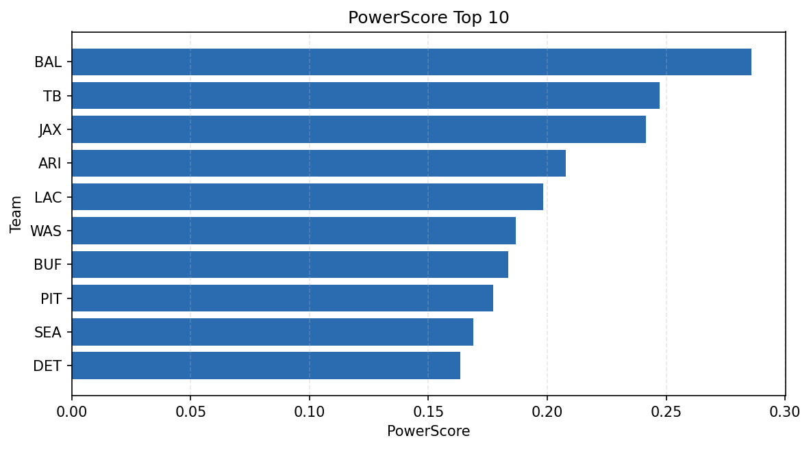

# Weekly Report - Season 2024, Week 7

_Generated at 2025-12-28T14:29:41.051530+00:00 (UTC)_

Data root: `data`

## Layer Shapes

| Layer | Artifact | Manifest | Rows | Columns | Status |
|-------|----------|----------|------|---------|--------|
| L1 Ingest | `data\l1\2024\7.parquet` | `data\l1\2024\7_manifest.json` | 2566 | 18 | ready |
| L2 Clean | `data\l2\2024\7.parquet` | `data\l2\2024\7_manifest.json` | 2566 | 24 | ready |
| L3 Team Week | `data\l3_team_week\2024\7.parquet` | `data\l3_team_week\2024\7_manifest.json` | 30 | 34 | ready |

## L2 Audit Snapshot

Last 3 entries from `data\l2_audit\2024\7_audit.jsonl`:

- {"step": "load", "details": "Loaded L1 parquet", "rows": 2566, "cols": 18, "timestamp": "2025-12-28T14:29:40.641609+00:00"}
- {"step": "prepare", "details": "Normalized team aliases, filtered season/week, deduplicated keys", "rows": 2566, "cols": 24, "rows_removed": 0, "timestamp": "2025-12-28T14:29:40.641609+00:00"}
- {"step": "validate", "details": "Validated against L2 contract and guardrails", "rows": 2566, "cols": 24, "timestamp": "2025-12-28T14:29:40.641609+00:00"}

## L3 Sanity

- Rows processed: 30
- Columns available: 34
- Artifact path: `data\l3_team_week\2024\7.parquet`

## Metrics Snapshot

### L4 Core12 Preview

- Artifact: `data\l4_core12\2024\7.parquet`
- Manifest: `data\l4_core12\2024\7_manifest.json`
- Rows: 30
- Columns: 27

| TEAM | core_epa_off | core_sr_off | core_sr_def |
| --- | --- | --- | --- |
| BAL | 0.29330606382389207 | 0.5263157894736842 | 0.52 |
| JAX | 0.22917353960187875 | 0.5616438356164384 | 0.41025641025641024 |
| WAS | 0.21786614625769504 | 0.5764705882352941 | 0.45161290322580644 |
| PIT | 0.17631292458446252 | 0.4523809523809524 | 0.4342105263157895 |
| SEA | 0.17064398312155013 | 0.45454545454545453 | 0.4838709677419355 |

### PowerScore Rankings

- Artifact: `data\l4_powerscore\2024\7.parquet`
- Manifest: `data\l4_powerscore\2024\7_manifest.json`
- Rows: 30
- Columns: 4

| team | power_score |
| --- | --- |
| LAC | 2.1252174553567866 |
| TB | 1.8859957238647829 |
| NE | 1.8749561872861595 |
| WAS | 1.858484410849529 |
| JAX | 1.8389719448260453 |
| ATL | 1.797430925148869 |
| SEA | 1.6856047838317543 |
| PIT | 1.6783974652558626 |
| KC | 1.6766108558779143 |
| ARI | 1.658105094513778 |

## Visualizations

