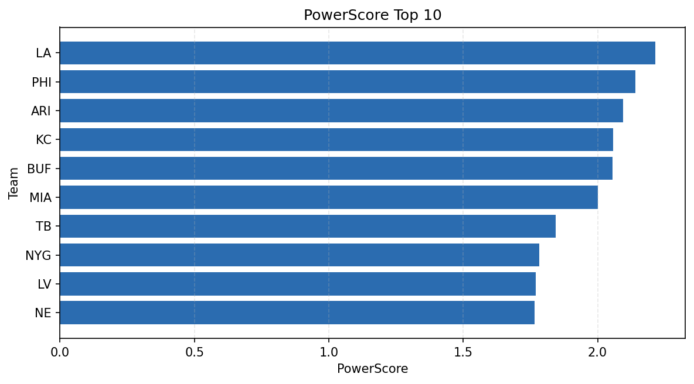

# Weekly Report - Season 2024, Week 8

_Generated at 2025-12-28T14:30:35.770645+00:00 (UTC)_

Data root: `data`

## Layer Shapes

| Layer | Artifact | Manifest | Rows | Columns | Status |
|-------|----------|----------|------|---------|--------|
| L1 Ingest | `data\l1\2024\8.parquet` | `data\l1\2024\8_manifest.json` | 2815 | 18 | ready |
| L2 Clean | `data\l2\2024\8.parquet` | `data\l2\2024\8_manifest.json` | 2815 | 24 | ready |
| L3 Team Week | `data\l3_team_week\2024\8.parquet` | `data\l3_team_week\2024\8_manifest.json` | 32 | 34 | ready |

## L2 Audit Snapshot

Last 3 entries from `data\l2_audit\2024\8_audit.jsonl`:

- {"step": "load", "details": "Loaded L1 parquet", "rows": 2815, "cols": 18, "timestamp": "2025-12-28T14:30:35.263304+00:00"}
- {"step": "prepare", "details": "Normalized team aliases, filtered season/week, deduplicated keys", "rows": 2815, "cols": 24, "rows_removed": 0, "timestamp": "2025-12-28T14:30:35.263304+00:00"}
- {"step": "validate", "details": "Validated against L2 contract and guardrails", "rows": 2815, "cols": 24, "timestamp": "2025-12-28T14:30:35.263304+00:00"}

## L3 Sanity

- Rows processed: 32
- Columns available: 34
- Artifact path: `data\l3_team_week\2024\8.parquet`

## Metrics Snapshot

### L4 Core12 Preview

- Artifact: `data\l4_core12\2024\8.parquet`
- Manifest: `data\l4_core12\2024\8_manifest.json`
- Rows: 32
- Columns: 27

| TEAM | core_epa_off | core_sr_off | core_sr_def |
| --- | --- | --- | --- |
| PHI | 0.31127900771159484 | 0.5394736842105263 | 0.4507042253521127 |
| ARI | 0.22239151602633386 | 0.5301204819277109 | 0.5316455696202531 |
| MIA | 0.196556917992951 | 0.5316455696202531 | 0.5301204819277109 |
| BUF | 0.1864909841381806 | 0.5212765957446809 | 0.4852941176470588 |
| DET | 0.18217850354267284 | 0.578125 | 0.4329896907216495 |

### PowerScore Rankings

- Artifact: `data\l4_powerscore\2024\8.parquet`
- Manifest: `data\l4_powerscore\2024\8_manifest.json`
- Rows: 32
- Columns: 4

| team | power_score |
| --- | --- |
| LA | 2.2157852586520717 |
| PHI | 2.140492023316392 |
| ARI | 2.094122979134179 |
| KC | 2.058513326449588 |
| BUF | 2.055773969031573 |
| MIA | 2.0017401724634185 |
| TB | 1.84353916910585 |
| NYG | 1.7819414592697498 |
| LV | 1.7690334071102367 |
| NE | 1.7644786984306915 |

## Visualizations

