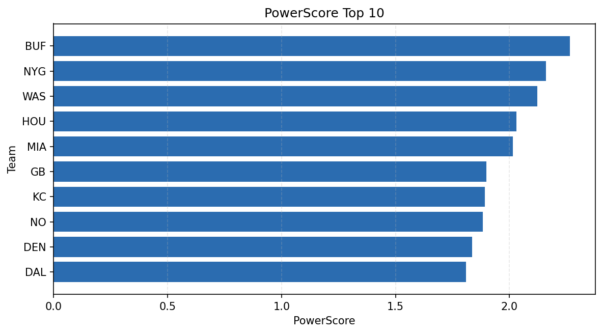

# Weekly Report - Season 2024, Week 9

_Generated at 2025-12-28T14:31:32.560970+00:00 (UTC)_

Data root: `data`

## Layer Shapes

| Layer | Artifact | Manifest | Rows | Columns | Status |
|-------|----------|----------|------|---------|--------|
| L1 Ingest | `data\l1\2024\9.parquet` | `data\l1\2024\9_manifest.json` | 2651 | 18 | ready |
| L2 Clean | `data\l2\2024\9.parquet` | `data\l2\2024\9_manifest.json` | 2651 | 24 | ready |
| L3 Team Week | `data\l3_team_week\2024\9.parquet` | `data\l3_team_week\2024\9_manifest.json` | 30 | 34 | ready |

## L2 Audit Snapshot

Last 3 entries from `data\l2_audit\2024\9_audit.jsonl`:

- {"step": "load", "details": "Loaded L1 parquet", "rows": 2651, "cols": 18, "timestamp": "2025-12-28T14:31:32.186454+00:00"}
- {"step": "prepare", "details": "Normalized team aliases, filtered season/week, deduplicated keys", "rows": 2651, "cols": 24, "rows_removed": 0, "timestamp": "2025-12-28T14:31:32.186454+00:00"}
- {"step": "validate", "details": "Validated against L2 contract and guardrails", "rows": 2651, "cols": 24, "timestamp": "2025-12-28T14:31:32.186454+00:00"}

## L3 Sanity

- Rows processed: 30
- Columns available: 34
- Artifact path: `data\l3_team_week\2024\9.parquet`

## Metrics Snapshot

### L4 Core12 Preview

- Artifact: `data\l4_core12\2024\9.parquet`
- Manifest: `data\l4_core12\2024\9_manifest.json`
- Rows: 30
- Columns: 27

| TEAM | core_epa_off | core_sr_off | core_sr_def |
| --- | --- | --- | --- |
| BAL | 0.3334259262742245 | 0.589041095890411 | 0.36046511627906974 |
| WAS | 0.21738633287449677 | 0.5866666666666667 | 0.48717948717948717 |
| BUF | 0.21488951051142066 | 0.5875 | 0.569620253164557 |
| MIA | 0.2097066447398142 | 0.569620253164557 | 0.5875 |
| KC | 0.13981103706219705 | 0.5346534653465347 | 0.4444444444444444 |

### PowerScore Rankings

- Artifact: `data\l4_powerscore\2024\9.parquet`
- Manifest: `data\l4_powerscore\2024\9_manifest.json`
- Rows: 30
- Columns: 4

| team | power_score |
| --- | --- |
| BUF | 2.26402765762696 |
| NYG | 2.1591524768172263 |
| WAS | 2.122826362285572 |
| HOU | 2.0297863652018213 |
| MIA | 2.014335846607914 |
| GB | 1.8982454827850983 |
| KC | 1.8926089452573982 |
| NO | 1.8836072564973627 |
| DEN | 1.83532787603349 |
| DAL | 1.8081033671051483 |

## Visualizations

