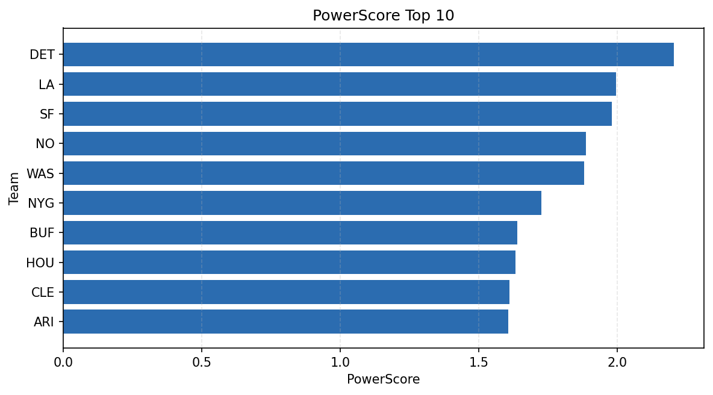

# Weekly Report - Season 2025, Week 10

_Generated at 2026-01-08T19:17:01.961640+00:00 (UTC)_

Data root: `data`

## Layer Shapes

| Layer | Artifact | Manifest | Rows | Columns | Status |
|-------|----------|----------|------|---------|--------|
| L1 Ingest | `data\l1\2025\10.parquet` | `data\l1\2025\10_manifest.json` | 2400 | 18 | ready |
| L2 Clean | `data\l2\2025\10.parquet` | `data\l2\2025\10_manifest.json` | 2400 | 24 | ready |
| L3 Team Week | `data\l3_team_week\2025\10.parquet` | `data\l3_team_week\2025\10_manifest.json` | 28 | 34 | ready |

## L2 Audit Snapshot

Last 3 entries from `data\l2_audit\2025\10_audit.jsonl`:

- {"step": "load", "details": "Loaded L1 parquet", "rows": 2400, "cols": 18, "timestamp": "2026-01-08T19:17:01.550489+00:00"}
- {"step": "prepare", "details": "Normalized team aliases, filtered season/week, deduplicated keys", "rows": 2400, "cols": 24, "rows_removed": 0, "timestamp": "2026-01-08T19:17:01.550489+00:00"}
- {"step": "validate", "details": "Validated against L2 contract and guardrails", "rows": 2400, "cols": 24, "timestamp": "2026-01-08T19:17:01.550489+00:00"}

## L3 Sanity

- Rows processed: 28
- Columns available: 34
- Artifact path: `data\l3_team_week\2025\10.parquet`

## Metrics Snapshot

### L4 Core12 Preview

- Artifact: `data\l4_core12\2025\10.parquet`
- Manifest: `data\l4_core12\2025\10_manifest.json`
- Rows: 28
- Columns: 27

| TEAM | core_epa_off | core_sr_off | core_sr_def |
| --- | --- | --- | --- |
| DET | 0.4432874280249789 | 0.6071428571428571 | 0.4657534246575342 |
| LA | 0.3305476015104967 | 0.6352941176470588 | 0.5769230769230769 |
| MIA | 0.26882055459488463 | 0.44776119402985076 | 0.48148148148148145 |
| WAS | 0.15374722743043293 | 0.4657534246575342 | 0.6071428571428571 |
| NE | 0.14365394537647566 | 0.41025641025641024 | 0.5176470588235295 |

### PowerScore Rankings

- Artifact: `data\l4_powerscore\2025\10.parquet`
- Manifest: `data\l4_powerscore\2025\10_manifest.json`
- Rows: 28
- Columns: 4

| team | power_score |
| --- | --- |
| DET | 2.2043524262472105 |
| LA | 1.99625127055782 |
| SF | 1.981711763946619 |
| NO | 1.8870704827835945 |
| WAS | 1.8811295935922532 |
| NYG | 1.7255929956381464 |
| BUF | 1.6393739591404408 |
| HOU | 1.6324294657960159 |
| CLE | 1.6123229780170192 |
| ARI | 1.6071962155752726 |

## Visualizations

