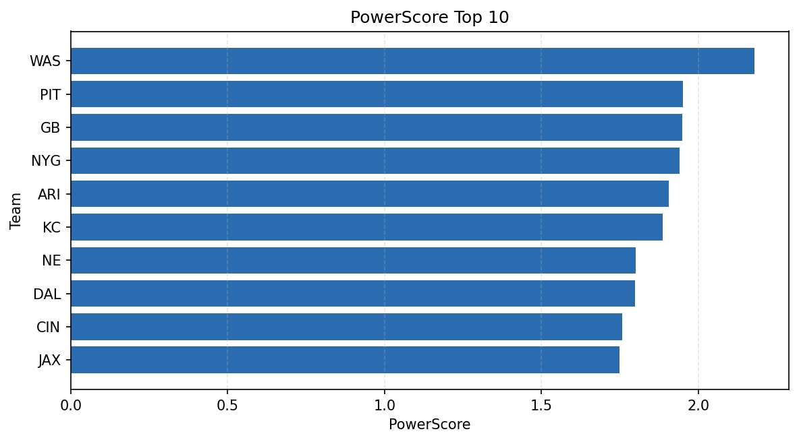

# Weekly Report - Season 2025, Week 11

_Generated at 2025-11-20T09:32:16.437195+00:00 (UTC)_

Data root: `data`

## Layer Shapes

| Layer | Artifact | Manifest | Rows | Columns | Status |
|-------|----------|----------|------|---------|--------|
| L1 Ingest | `data\l1\2025\11.parquet` | `data\l1\2025\11_manifest.json` | 2575 | 18 | ready |
| L2 Clean | `data\l2\2025\11.parquet` | `data\l2\2025\11_manifest.json` | 2575 | 24 | ready |
| L3 Team Week | `data\l3_team_week\2025\11.parquet` | `data\l3_team_week\2025\11_manifest.json` | 30 | 34 | ready |

## L2 Audit Snapshot

Last 3 entries from `data\l2_audit\2025\11_audit.jsonl`:

- {"step": "load", "details": "Loaded L1 parquet", "rows": 2575, "cols": 18, "timestamp": "2025-11-20T09:32:15.734343+00:00"}
- {"step": "prepare", "details": "Normalized team aliases, filtered season/week, deduplicated keys", "rows": 2575, "cols": 24, "rows_removed": 0, "timestamp": "2025-11-20T09:32:15.734343+00:00"}
- {"step": "validate", "details": "Validated against L2 contract and guardrails", "rows": 2575, "cols": 24, "timestamp": "2025-11-20T09:32:15.734343+00:00"}

## L3 Sanity

- Rows processed: 30
- Columns available: 34
- Artifact path: `data\l3_team_week\2025\11.parquet`

## Metrics Snapshot

### L4 Core12 Preview

- Artifact: `data\l4_core12\2025\11.parquet`
- Manifest: `data\l4_core12\2025\11_manifest.json`
- Rows: N/A
- Columns: N/A

| TEAM | core_epa_off | core_sr_off | core_sr_def |
| --- | --- | --- | --- |
| BUF | 0.3199538236690892 | 0.5416666666666666 | 0.4946236559139785 |
| GB | 0.29348152830018936 | 0.4852941176470588 | 0.47674418604651164 |
| SF | 0.24636443573478106 | 0.5540540540540541 | 0.4639175257731959 |
| PIT | 0.14815714723074142 | 0.49382716049382713 | 0.36904761904761907 |
| TB | 0.14189803484146313 | 0.4946236559139785 | 0.5416666666666666 |

### PowerScore Rankings

- Artifact: `data\l4_powerscore\2025\11.parquet`
- Manifest: `data\l4_powerscore\2025\11_manifest.json`
- Rows: 30
- Columns: 4

| team | power_score |
| --- | --- |
| BUF | 0.30355788969691827 |
| GB | 0.27484013419197817 |
| TB | 0.256665829616502 |
| NYG | 0.23440893341350166 |
| SF | 0.23016320421093414 |
| MIA | 0.19716749019796853 |
| DAL | 0.18401614262759125 |
| ATL | 0.18233856199423165 |
| CAR | 0.18218323778157525 |
| WAS | 0.1818644944808865 |

## Visualizations

