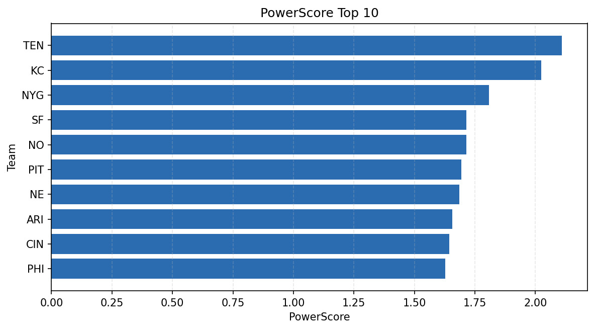

# Weekly Report - Season 2025, Week 12

_Generated at 2025-11-25T17:10:02.584167+00:00 (UTC)_

Data root: `data`

## Layer Shapes

| Layer | Artifact | Manifest | Rows | Columns | Status |
|-------|----------|----------|------|---------|--------|
| L1 Ingest | `data\l1\2025\12.parquet` | `data\l1\2025\12_manifest.json` | 2445 | 18 | ready |
| L2 Clean | `data\l2\2025\12.parquet` | `data\l2\2025\12_manifest.json` | 2445 | 24 | ready |
| L3 Team Week | `data\l3_team_week\2025\12.parquet` | `data\l3_team_week\2025\12_manifest.json` | 28 | 34 | ready |

## L2 Audit Snapshot

Last 3 entries from `data\l2_audit\2025\12_audit.jsonl`:

- {"step": "load", "details": "Loaded L1 parquet", "rows": 2445, "cols": 18, "timestamp": "2025-11-25T17:10:02.092631+00:00"}
- {"step": "prepare", "details": "Normalized team aliases, filtered season/week, deduplicated keys", "rows": 2445, "cols": 24, "rows_removed": 0, "timestamp": "2025-11-25T17:10:02.092631+00:00"}
- {"step": "validate", "details": "Validated against L2 contract and guardrails", "rows": 2445, "cols": 24, "timestamp": "2025-11-25T17:10:02.092631+00:00"}

## L3 Sanity

- Rows processed: 28
- Columns available: 34
- Artifact path: `data\l3_team_week\2025\12.parquet`

## Metrics Snapshot

### L4 Core12 Preview

- Artifact: `data\l4_core12\2025\12.parquet`
- Manifest: `data\l4_core12\2025\12_manifest.json`
- Rows: N/A
- Columns: N/A

| TEAM | core_epa_off | core_sr_off | core_sr_def |
| --- | --- | --- | --- |
| DET | 0.15410611207286518 | 0.5333333333333333 | 0.41836734693877553 |
| NYG | 0.11145007308116373 | 0.41836734693877553 | 0.5333333333333333 |
| SEA | 0.10045876206857139 | 0.4927536231884058 | 0.4111111111111111 |
| GB | 0.09718927070952771 | 0.5 | 0.46551724137931033 |
| BAL | 0.08521220073677026 | 0.41025641025641024 | 0.3918918918918919 |

### PowerScore Rankings

- Artifact: `data\l4_powerscore\2025\12.parquet`
- Manifest: `data\l4_powerscore\2025\12_manifest.json`
- Rows: 28
- Columns: 4

| team | power_score |
| --- | --- |
| DET | 0.23400493161951333 |
| NYG | 0.20503282962563343 |
| SEA | 0.1743403004643908 |
| NE | 0.16149196518522477 |
| DAL | 0.15214143725551416 |
| KC | 0.14336718219536634 |
| PIT | 0.1402991492008573 |
| CHI | 0.1381168402859544 |
| GB | 0.13721494153153724 |
| CIN | 0.13659833393501852 |

## Visualizations

