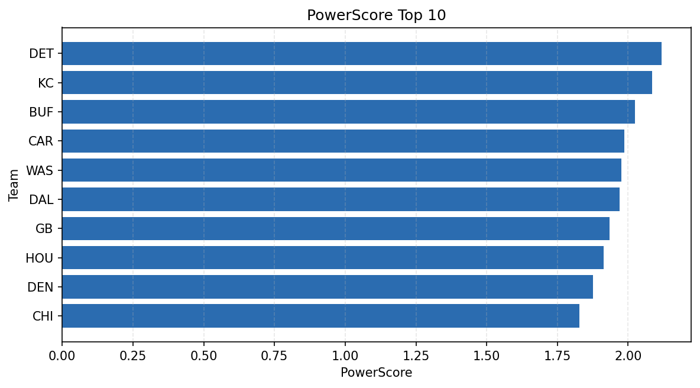

# Weekly Report - Season 2025, Week 13

_Generated at 2026-01-08T19:19:50.850414+00:00 (UTC)_

Data root: `data`

## Layer Shapes

| Layer | Artifact | Manifest | Rows | Columns | Status |
|-------|----------|----------|------|---------|--------|
| L1 Ingest | `data\l1\2025\13.parquet` | `data\l1\2025\13_manifest.json` | 2720 | 18 | ready |
| L2 Clean | `data\l2\2025\13.parquet` | `data\l2\2025\13_manifest.json` | 2720 | 24 | ready |
| L3 Team Week | `data\l3_team_week\2025\13.parquet` | `data\l3_team_week\2025\13_manifest.json` | 32 | 34 | ready |

## L2 Audit Snapshot

Last 3 entries from `data\l2_audit\2025\13_audit.jsonl`:

- {"step": "load", "details": "Loaded L1 parquet", "rows": 2720, "cols": 18, "timestamp": "2026-01-08T19:19:50.412393+00:00"}
- {"step": "prepare", "details": "Normalized team aliases, filtered season/week, deduplicated keys", "rows": 2720, "cols": 24, "rows_removed": 0, "timestamp": "2026-01-08T19:19:50.412393+00:00"}
- {"step": "validate", "details": "Validated against L2 contract and guardrails", "rows": 2720, "cols": 24, "timestamp": "2026-01-08T19:19:50.412393+00:00"}

## L3 Sanity

- Rows processed: 32
- Columns available: 34
- Artifact path: `data\l3_team_week\2025\13.parquet`

## Metrics Snapshot

### L4 Core12 Preview

- Artifact: `data\l4_core12\2025\13.parquet`
- Manifest: `data\l4_core12\2025\13_manifest.json`
- Rows: 32
- Columns: 27

| TEAM | core_epa_off | core_sr_off | core_sr_def |
| --- | --- | --- | --- |
| GB | 0.2306530645310685 | 0.5064935064935064 | 0.4805194805194805 |
| DAL | 0.20702679744311447 | 0.4942528735632184 | 0.4642857142857143 |
| LA | 0.18383176552239233 | 0.6307692307692307 | 0.45 |
| KC | 0.17184441168570802 | 0.4642857142857143 | 0.4942528735632184 |
| CAR | 0.1697608939721249 | 0.45 | 0.6307692307692307 |

### PowerScore Rankings

- Artifact: `data\l4_powerscore\2025\13.parquet`
- Manifest: `data\l4_powerscore\2025\13_manifest.json`
- Rows: 32
- Columns: 4

| team | power_score |
| --- | --- |
| DET | 2.1174126548402303 |
| KC | 2.0842889988167164 |
| BUF | 2.024852841064918 |
| CAR | 1.9864604437725002 |
| WAS | 1.9751246068230988 |
| DAL | 1.9703914798330362 |
| GB | 1.9334071584941597 |
| HOU | 1.9133788413226074 |
| DEN | 1.8762155455493716 |
| CHI | 1.8270232527081856 |

## Visualizations

