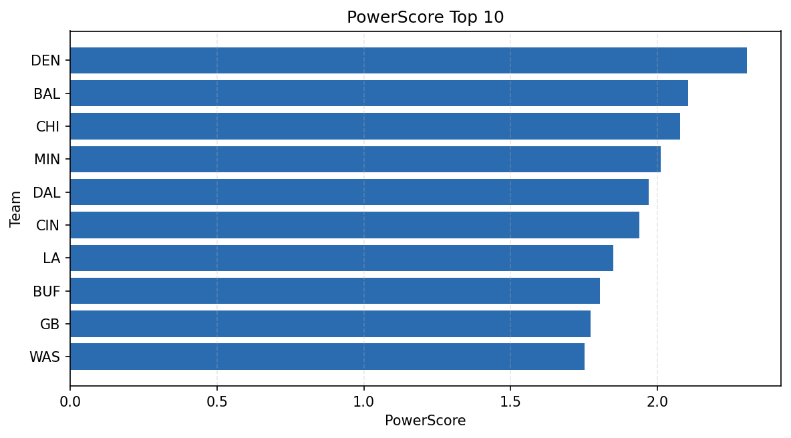

# Weekly Report - Season 2025, Week 14

_Generated at 2025-12-10T18:42:23.089928+00:00 (UTC)_

Data root: `data`

## Layer Shapes

| Layer | Artifact | Manifest | Rows | Columns | Status |
|-------|----------|----------|------|---------|--------|
| L1 Ingest | `data\l1\2025\14.parquet` | `data\l1\2025\14_manifest.json` | 2422 | 18 | ready |
| L2 Clean | `data\l2\2025\14.parquet` | `data\l2\2025\14_manifest.json` | 2422 | 24 | ready |
| L3 Team Week | `data\l3_team_week\2025\14.parquet` | `data\l3_team_week\2025\14_manifest.json` | 28 | 34 | ready |

## L2 Audit Snapshot

Last 3 entries from `data\l2_audit\2025\14_audit.jsonl`:

- {"step": "load", "details": "Loaded L1 parquet", "rows": 2422, "cols": 18, "timestamp": "2025-12-10T18:42:22.455571+00:00"}
- {"step": "prepare", "details": "Normalized team aliases, filtered season/week, deduplicated keys", "rows": 2422, "cols": 24, "rows_removed": 0, "timestamp": "2025-12-10T18:42:22.455571+00:00"}
- {"step": "validate", "details": "Validated against L2 contract and guardrails", "rows": 2422, "cols": 24, "timestamp": "2025-12-10T18:42:22.455571+00:00"}

## L3 Sanity

- Rows processed: 28
- Columns available: 34
- Artifact path: `data\l3_team_week\2025\14.parquet`

## Metrics Snapshot

### L4 Core12 Preview

- Artifact: `data\l4_core12\2025\14.parquet`
- Manifest: `data\l4_core12\2025\14_manifest.json`
- Rows: N/A
- Columns: N/A

| TEAM | core_epa_off | core_sr_off | core_sr_def |
| --- | --- | --- | --- |
| LA | 0.31825669343710283 | 0.6136363636363636 | 0.40963855421686746 |
| BUF | 0.2324055934131339 | 0.5844155844155844 | 0.5657894736842105 |
| SEA | 0.21866285848104722 | 0.5324675324675324 | 0.41975308641975306 |
| DET | 0.2135551189462286 | 0.5116279069767442 | 0.4897959183673469 |
| MIN | 0.2115089889615774 | 0.52 | 0.3442622950819672 |

### PowerScore Rankings

- Artifact: `data\l4_powerscore\2025\14.parquet`
- Manifest: `data\l4_powerscore\2025\14_manifest.json`
- Rows: 28
- Columns: 4

| team | power_score |
| --- | --- |
| BUF | 0.29130749992637306 |
| LA | 0.2775893018655502 |
| GB | 0.26700458161503476 |
| CIN | 0.2654758415116801 |
| DET | 0.24161802032718452 |
| CHI | 0.22171442613050713 |
| DAL | 0.2151149896811976 |
| PIT | 0.20914818598855883 |
| BAL | 0.1996322238954261 |
| SEA | 0.19336250649288944 |

## Visualizations

