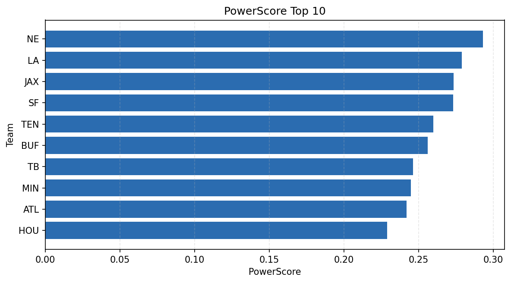

# Weekly Report - Season 2025, Week 15

_Generated at 2025-12-28T12:10:47.862444+00:00 (UTC)_

Data root: `data`

## Layer Shapes

| Layer | Artifact | Manifest | Rows | Columns | Status |
|-------|----------|----------|------|---------|--------|
| L1 Ingest | `data\l1\2025\15.parquet` | `data\l1\2025\15_manifest.json` | 2688 | 18 | ready |
| L2 Clean | `data\l2\2025\15.parquet` | `data\l2\2025\15_manifest.json` | 2688 | 24 | ready |
| L3 Team Week | `data\l3_team_week\2025\15.parquet` | `data\l3_team_week\2025\15_manifest.json` | 32 | 34 | ready |

## L2 Audit Snapshot

Last 3 entries from `data\l2_audit\2025\15_audit.jsonl`:

- {"step": "load", "details": "Loaded L1 parquet", "rows": 2688, "cols": 18, "timestamp": "2025-12-28T12:10:47.458653+00:00"}
- {"step": "prepare", "details": "Normalized team aliases, filtered season/week, deduplicated keys", "rows": 2688, "cols": 24, "rows_removed": 0, "timestamp": "2025-12-28T12:10:47.458653+00:00"}
- {"step": "validate", "details": "Validated against L2 contract and guardrails", "rows": 2688, "cols": 24, "timestamp": "2025-12-28T12:10:47.458653+00:00"}

## L3 Sanity

- Rows processed: 32
- Columns available: 34
- Artifact path: `data\l3_team_week\2025\15.parquet`

## Metrics Snapshot

### L4 Core12 Preview

- Artifact: `data\l4_core12\2025\15.parquet`
- Manifest: `data\l4_core12\2025\15_manifest.json`
- Rows: N/A
- Columns: N/A

| TEAM | core_epa_off | core_sr_off | core_sr_def |
| --- | --- | --- | --- |
| JAX | 0.31147031198385394 | 0.5822784810126582 | 0.4883720930232558 |
| SF | 0.26011142204515636 | 0.5652173913043478 | 0.5571428571428572 |
| PHI | 0.2513000146509745 | 0.5769230769230769 | 0.3148148148148148 |
| HOU | 0.24127105728958745 | 0.5180722891566265 | 0.49382716049382713 |
| BUF | 0.2278223353522745 | 0.4772727272727273 | 0.5882352941176471 |

### PowerScore Rankings

- Artifact: `data\l4_powerscore\2025\15.parquet`
- Manifest: `data\l4_powerscore\2025\15_manifest.json`
- Rows: 32
- Columns: 4

| team | power_score |
| --- | --- |
| NE | 0.29297491885082955 |
| LA | 0.2790260927685738 |
| JAX | 0.2733261031063845 |
| SF | 0.27310854786591926 |
| TEN | 0.25982101580527217 |
| BUF | 0.25609420998729165 |
| TB | 0.24633507722058126 |
| MIN | 0.24483236260912777 |
| ATL | 0.2419224318747426 |
| HOU | 0.22878159762691375 |

## Visualizations

