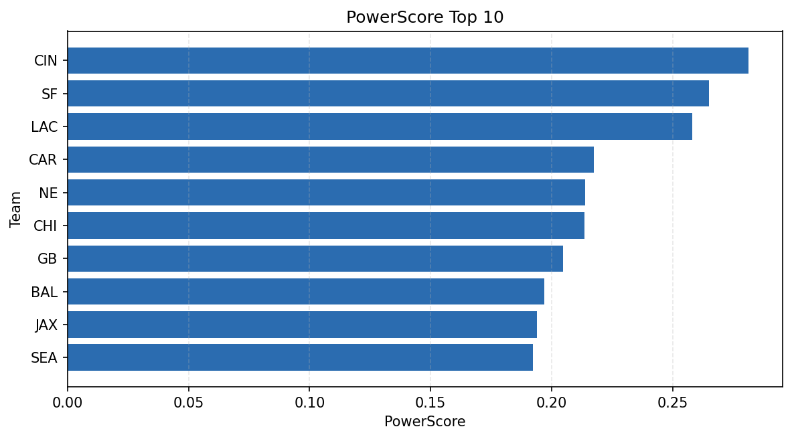

# Weekly Report - Season 2025, Week 16

_Generated at 2025-12-28T12:12:10.408093+00:00 (UTC)_

Data root: `data`

## Layer Shapes

| Layer | Artifact | Manifest | Rows | Columns | Status |
|-------|----------|----------|------|---------|--------|
| L1 Ingest | `data\l1\2025\16.parquet` | `data\l1\2025\16_manifest.json` | 2750 | 18 | ready |
| L2 Clean | `data\l2\2025\16.parquet` | `data\l2\2025\16_manifest.json` | 2750 | 24 | ready |
| L3 Team Week | `data\l3_team_week\2025\16.parquet` | `data\l3_team_week\2025\16_manifest.json` | 32 | 34 | ready |

## L2 Audit Snapshot

Last 3 entries from `data\l2_audit\2025\16_audit.jsonl`:

- {"step": "load", "details": "Loaded L1 parquet", "rows": 2750, "cols": 18, "timestamp": "2025-12-28T12:12:09.973532+00:00"}
- {"step": "prepare", "details": "Normalized team aliases, filtered season/week, deduplicated keys", "rows": 2750, "cols": 24, "rows_removed": 0, "timestamp": "2025-12-28T12:12:09.973532+00:00"}
- {"step": "validate", "details": "Validated against L2 contract and guardrails", "rows": 2750, "cols": 24, "timestamp": "2025-12-28T12:12:09.973532+00:00"}

## L3 Sanity

- Rows processed: 32
- Columns available: 34
- Artifact path: `data\l3_team_week\2025\16.parquet`

## Metrics Snapshot

### L4 Core12 Preview

- Artifact: `data\l4_core12\2025\16.parquet`
- Manifest: `data\l4_core12\2025\16_manifest.json`
- Rows: N/A
- Columns: N/A

| TEAM | core_epa_off | core_sr_off | core_sr_def |
| --- | --- | --- | --- |
| CIN | 0.3352459252346307 | 0.6 | 0.42105263157894735 |
| SF | 0.2930369664824045 | 0.573170731707317 | 0.5125 |
| LAC | 0.27269162780318695 | 0.5512820512820513 | 0.4520547945205479 |
| JAX | 0.1762837312665632 | 0.47191011235955055 | 0.4523809523809524 |
| CHI | 0.14900699914433063 | 0.4875 | 0.5119047619047619 |

### PowerScore Rankings

- Artifact: `data\l4_powerscore\2025\16.parquet`
- Manifest: `data\l4_powerscore\2025\16_manifest.json`
- Rows: 32
- Columns: 4

| team | power_score |
| --- | --- |
| CIN | 0.2813661518512833 |
| SF | 0.26498809476530677 |
| LAC | 0.25807770201005287 |
| CAR | 0.21759415813411276 |
| NE | 0.21393278683024713 |
| CHI | 0.21354461955150497 |
| GB | 0.20461120897285928 |
| BAL | 0.19704150035678714 |
| JAX | 0.19386076248384693 |
| SEA | 0.1922036355082784 |

## Visualizations

