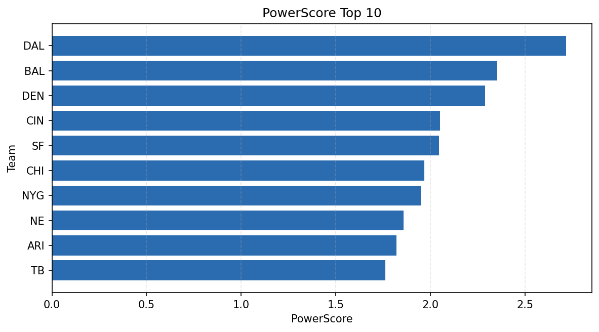

# Weekly Report - Season 2025, Week 17

_Generated at 2026-01-08T19:24:16.851229+00:00 (UTC)_

Data root: `data`

## Layer Shapes

| Layer | Artifact | Manifest | Rows | Columns | Status |
|-------|----------|----------|------|---------|--------|
| L1 Ingest | `data\l1\2025\17.parquet` | `data\l1\2025\17_manifest.json` | 2664 | 18 | ready |
| L2 Clean | `data\l2\2025\17.parquet` | `data\l2\2025\17_manifest.json` | 2664 | 24 | ready |
| L3 Team Week | `data\l3_team_week\2025\17.parquet` | `data\l3_team_week\2025\17_manifest.json` | 32 | 34 | ready |

## L2 Audit Snapshot

Last 3 entries from `data\l2_audit\2025\17_audit.jsonl`:

- {"step": "load", "details": "Loaded L1 parquet", "rows": 2664, "cols": 18, "timestamp": "2026-01-08T19:24:16.381462+00:00"}
- {"step": "prepare", "details": "Normalized team aliases, filtered season/week, deduplicated keys", "rows": 2664, "cols": 24, "rows_removed": 0, "timestamp": "2026-01-08T19:24:16.381462+00:00"}
- {"step": "validate", "details": "Validated against L2 contract and guardrails", "rows": 2664, "cols": 24, "timestamp": "2026-01-08T19:24:16.381462+00:00"}

## L3 Sanity

- Rows processed: 32
- Columns available: 34
- Artifact path: `data\l3_team_week\2025\17.parquet`

## Metrics Snapshot

### L4 Core12 Preview

- Artifact: `data\l4_core12\2025\17.parquet`
- Manifest: `data\l4_core12\2025\17_manifest.json`
- Rows: 32
- Columns: 27

| TEAM | core_epa_off | core_sr_off | core_sr_def |
| --- | --- | --- | --- |
| NE | 0.37327457903884353 | 0.5875 | 0.44155844155844154 |
| CIN | 0.29321366006119565 | 0.5054945054945055 | 0.44594594594594594 |
| BAL | 0.2847226419624813 | 0.5851063829787234 | 0.55 |
| NYG | 0.2620991010077392 | 0.4936708860759494 | 0.410958904109589 |
| SF | 0.2614772012033923 | 0.5681818181818182 | 0.5058823529411764 |

### PowerScore Rankings

- Artifact: `data\l4_powerscore\2025\17.parquet`
- Manifest: `data\l4_powerscore\2025\17_manifest.json`
- Rows: 32
- Columns: 4

| team | power_score |
| --- | --- |
| DAL | 2.716817576861568 |
| BAL | 2.352683376658248 |
| DEN | 2.2893244719357018 |
| CIN | 2.0517781234670953 |
| SF | 2.0450045637012195 |
| CHI | 1.9687896837614836 |
| NYG | 1.9477083309974719 |
| NE | 1.8575863190100517 |
| ARI | 1.819438166069258 |
| TB | 1.7615768535377943 |

## Visualizations

