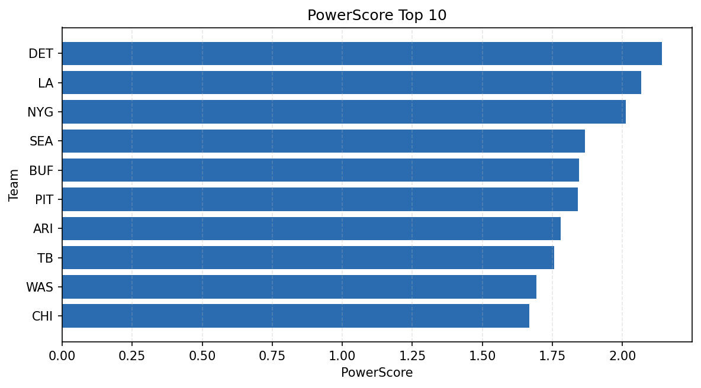

# Weekly Report - Season 2025, Week 18

_Generated at 2026-01-08T19:26:38.910481+00:00 (UTC)_

Data root: `data`

## Layer Shapes

| Layer | Artifact | Manifest | Rows | Columns | Status |
|-------|----------|----------|------|---------|--------|
| L1 Ingest | `data\l1\2025\18.parquet` | `data\l1\2025\18_manifest.json` | 2636 | 18 | ready |
| L2 Clean | `data\l2\2025\18.parquet` | `data\l2\2025\18_manifest.json` | 2636 | 24 | ready |
| L3 Team Week | `data\l3_team_week\2025\18.parquet` | `data\l3_team_week\2025\18_manifest.json` | 32 | 34 | ready |

## L2 Audit Snapshot

Last 3 entries from `data\l2_audit\2025\18_audit.jsonl`:

- {"step": "load", "details": "Loaded L1 parquet", "rows": 2636, "cols": 18, "timestamp": "2026-01-08T19:26:38.516172+00:00"}
- {"step": "prepare", "details": "Normalized team aliases, filtered season/week, deduplicated keys", "rows": 2636, "cols": 24, "rows_removed": 0, "timestamp": "2026-01-08T19:26:38.516172+00:00"}
- {"step": "validate", "details": "Validated against L2 contract and guardrails", "rows": 2636, "cols": 24, "timestamp": "2026-01-08T19:26:38.516172+00:00"}

## L3 Sanity

- Rows processed: 32
- Columns available: 34
- Artifact path: `data\l3_team_week\2025\18.parquet`

## Metrics Snapshot

### L4 Core12 Preview

- Artifact: `data\l4_core12\2025\18.parquet`
- Manifest: `data\l4_core12\2025\18_manifest.json`
- Rows: 32
- Columns: 27

| TEAM | core_epa_off | core_sr_off | core_sr_def |
| --- | --- | --- | --- |
| JAX | 0.2671483751435421 | 0.5263157894736842 | 0.38028169014084506 |
| BUF | 0.23531699290566416 | 0.5542168674698795 | 0.39344262295081966 |
| LA | 0.18979755997337322 | 0.5483870967741935 | 0.4520547945205479 |
| NE | 0.18142676821566725 | 0.618421052631579 | 0.4722222222222222 |
| NYG | 0.16094299442256274 | 0.5108695652173914 | 0.43661971830985913 |

### PowerScore Rankings

- Artifact: `data\l4_powerscore\2025\18.parquet`
- Manifest: `data\l4_powerscore\2025\18_manifest.json`
- Rows: 32
- Columns: 4

| team | power_score |
| --- | --- |
| DET | 2.141930459661962 |
| LA | 2.0670735088332948 |
| NYG | 2.011381404732462 |
| SEA | 1.8652722916981017 |
| BUF | 1.8443491098596292 |
| PIT | 1.8404021551402598 |
| ARI | 1.7794037129828986 |
| TB | 1.7561708762846777 |
| WAS | 1.6920984146880829 |
| CHI | 1.6666536046368368 |

## Visualizations

