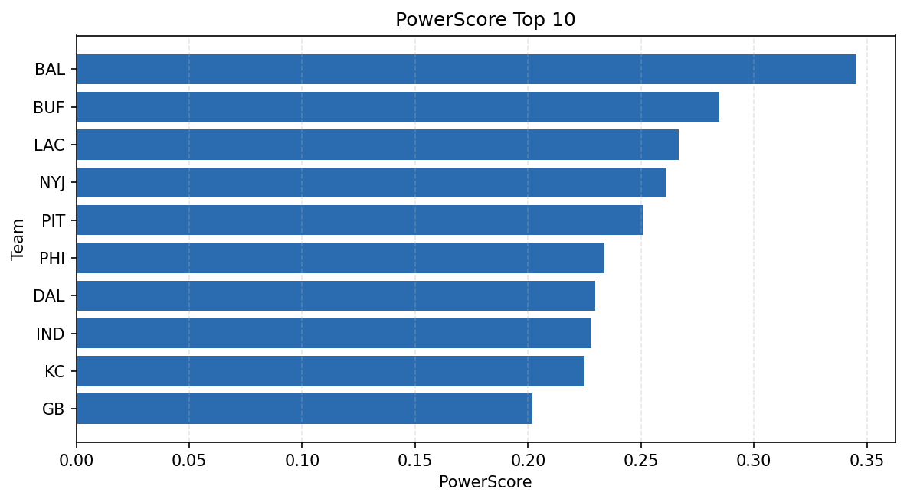

# Weekly Report - Season 2025, Week 1

_Generated at 2026-01-08T19:10:46.748845+00:00 (UTC)_

Data root: `data`

## Layer Shapes

| Layer | Artifact | Manifest | Rows | Columns | Status |
|-------|----------|----------|------|---------|--------|
| L1 Ingest | `data\l1\2025\1.parquet` | `data\l1\2025\1_manifest.json` | 2738 | 18 | ready |
| L2 Clean | `data\l2\2025\1.parquet` | `data\l2\2025\1_manifest.json` | 2738 | 24 | ready |
| L3 Team Week | `data\l3_team_week\2025\1.parquet` | `data\l3_team_week\2025\1_manifest.json` | 32 | 34 | ready |

## L2 Audit Snapshot

Last 3 entries from `data\l2_audit\2025\1_audit.jsonl`:

- {"step": "load", "details": "Loaded L1 parquet", "rows": 2738, "cols": 18, "timestamp": "2026-01-08T19:10:46.375762+00:00"}
- {"step": "prepare", "details": "Normalized team aliases, filtered season/week, deduplicated keys", "rows": 2738, "cols": 24, "rows_removed": 0, "timestamp": "2026-01-08T19:10:46.375762+00:00"}
- {"step": "validate", "details": "Validated against L2 contract and guardrails", "rows": 2738, "cols": 24, "timestamp": "2026-01-08T19:10:46.375762+00:00"}

## L3 Sanity

- Rows processed: 32
- Columns available: 34
- Artifact path: `data\l3_team_week\2025\1.parquet`

## Metrics Snapshot

### L4 Core12 Preview

- Artifact: `data\l4_core12\2025\1.parquet`
- Manifest: `data\l4_core12\2025\1_manifest.json`
- Rows: 32
- Columns: 27

| TEAM | core_epa_off | core_sr_off | core_sr_def |
| --- | --- | --- | --- |
| BAL | 0.3402929010236977 | 0.5633802816901409 | 0.48598130841121495 |
| IND | 0.2513866281246438 | 0.5529411764705883 | 0.47368421052631576 |
| LAC | 0.2110752395618661 | 0.5679012345679012 | 0.45569620253164556 |
| PIT | 0.20591976812907628 | 0.5064935064935064 | 0.55 |
| BUF | 0.20185621668558532 | 0.48598130841121495 | 0.5633802816901409 |

### PowerScore Rankings

- Artifact: `data\l4_powerscore\2025\1.parquet`
- Manifest: `data\l4_powerscore\2025\1_manifest.json`
- Rows: 32
- Columns: 4

| team | power_score |
| --- | --- |
| IND | 2.6235629757321464 |
| LAC | 2.26710227608836 |
| KC | 2.1770777073448153 |
| DAL | 2.0607478898134106 |
| ATL | 1.956955128917259 |
| PHI | 1.9516251222269299 |
| BUF | 1.906357429301344 |
| ARI | 1.89871988245048 |
| NYG | 1.8913859534515467 |
| CLE | 1.8751044835157813 |

## Visualizations

