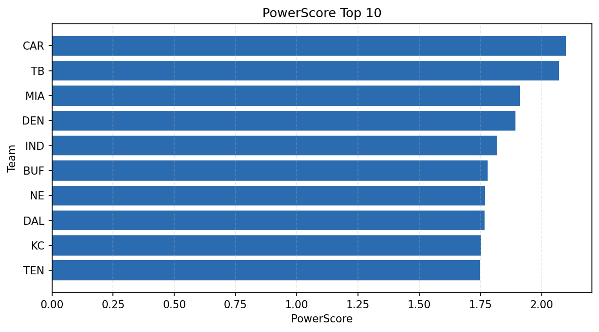

# Weekly Report - Season 2025, Week 2

_Generated at 2025-11-11T13:52:47.729161+00:00 (UTC)_

Data root: `data`

## Layer Shapes

| Layer | Artifact | Manifest | Rows | Columns | Status |
|-------|----------|----------|------|---------|--------|
| L1 Ingest | `data\l1\2025\2.parquet` | `data\l1\2025\2_manifest.json` | 2789 | 18 | ready |
| L2 Clean | `data\l2\2025\2.parquet` | `data\l2\2025\2_manifest.json` | 2789 | 24 | ready |
| L3 Team Week | `data\l3_team_week\2025\2.parquet` | `data\l3_team_week\2025\2_manifest.json` | 32 | 34 | ready |

## L2 Audit Snapshot

Last 3 entries from `data\l2_audit\2025\2_audit.jsonl`:

- {"step": "load", "details": "Loaded L1 parquet", "rows": 2789, "cols": 18, "timestamp": "2025-11-11T13:52:47.368676+00:00"}
- {"step": "prepare", "details": "Normalized team aliases, filtered season/week, deduplicated keys", "rows": 2789, "cols": 24, "rows_removed": 0, "timestamp": "2025-11-11T13:52:47.368676+00:00"}
- {"step": "validate", "details": "Validated against L2 contract and guardrails", "rows": 2789, "cols": 24, "timestamp": "2025-11-11T13:52:47.368676+00:00"}

## L3 Sanity

- Rows processed: 32
- Columns available: 34
- Artifact path: `data\l3_team_week\2025\2.parquet`

## Metrics Snapshot

### L4 Core12 Preview

- Artifact: `data\l4_core12\2025\2.parquet`
- Manifest: `data\l4_core12\2025\2_manifest.json`
- Rows: 32
- Columns: 15

| TEAM | core_epa_off | core_sr_off | core_sr_def |
| --- | --- | --- | --- |
| DET | 0.3040654425775366 | 0.5714285714285714 | 0.40229885057471265 |
| LA | 0.19871598221007972 | 0.5189873417721519 | 0.4659090909090909 |
| NYG | 0.18632809716192159 | 0.48863636363636365 | 0.48717948717948717 |
| NE | 0.18303553731758385 | 0.4430379746835443 | 0.46153846153846156 |
| BUF | 0.17734567434268278 | 0.45555555555555555 | 0.421875 |

### PowerScore Rankings

- Artifact: `data\l4_powerscore\2025\2.parquet`
- Manifest: `data\l4_powerscore\2025\2_manifest.json`
- Rows: 32
- Columns: 4

| team | power_score |
| --- | --- |
| DET | 0.2536407610368249 |
| DEN | 0.25220794305976507 |
| NYG | 0.23680385297588374 |
| IND | 0.23583787550546306 |
| LA | 0.22732183973862757 |
| DAL | 0.22630295857255983 |
| NE | 0.2095992214057603 |
| MIA | 0.19792176231527894 |
| CIN | 0.1878538876766444 |
| JAX | 0.18601446769125737 |

## Visualizations

