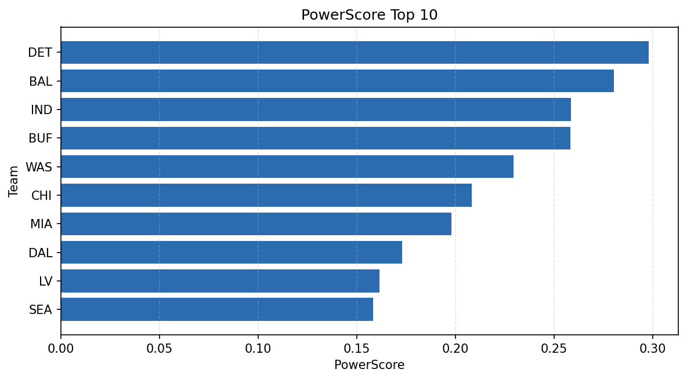

# Weekly Report - Season 2025, Week 3

_Generated at 2026-01-08T19:11:56.894307+00:00 (UTC)_

Data root: `data`

## Layer Shapes

| Layer | Artifact | Manifest | Rows | Columns | Status |
|-------|----------|----------|------|---------|--------|
| L1 Ingest | `data\l1\2025\3.parquet` | `data\l1\2025\3_manifest.json` | 2746 | 18 | ready |
| L2 Clean | `data\l2\2025\3.parquet` | `data\l2\2025\3_manifest.json` | 2746 | 24 | ready |
| L3 Team Week | `data\l3_team_week\2025\3.parquet` | `data\l3_team_week\2025\3_manifest.json` | 32 | 34 | ready |

## L2 Audit Snapshot

Last 3 entries from `data\l2_audit\2025\3_audit.jsonl`:

- {"step": "load", "details": "Loaded L1 parquet", "rows": 2746, "cols": 18, "timestamp": "2026-01-08T19:11:56.468077+00:00"}
- {"step": "prepare", "details": "Normalized team aliases, filtered season/week, deduplicated keys", "rows": 2746, "cols": 24, "rows_removed": 0, "timestamp": "2026-01-08T19:11:56.468077+00:00"}
- {"step": "validate", "details": "Validated against L2 contract and guardrails", "rows": 2746, "cols": 24, "timestamp": "2026-01-08T19:11:56.468077+00:00"}

## L3 Sanity

- Rows processed: 32
- Columns available: 34
- Artifact path: `data\l3_team_week\2025\3.parquet`

## Metrics Snapshot

### L4 Core12 Preview

- Artifact: `data\l4_core12\2025\3.parquet`
- Manifest: `data\l4_core12\2025\3_manifest.json`
- Rows: 32
- Columns: 27

| TEAM | core_epa_off | core_sr_off | core_sr_def |
| --- | --- | --- | --- |
| DET | 0.283452951274384 | 0.5862068965517241 | 0.5540540540540541 |
| IND | 0.2625449801109628 | 0.5972222222222222 | 0.4772727272727273 |
| WAS | 0.22180376984914274 | 0.5394736842105263 | 0.39285714285714285 |
| BUF | 0.22068571342104995 | 0.5405405405405406 | 0.4473684210526316 |
| CHI | 0.20045038077929248 | 0.4794520547945205 | 0.4827586206896552 |

### PowerScore Rankings

- Artifact: `data\l4_powerscore\2025\3.parquet`
- Manifest: `data\l4_powerscore\2025\3_manifest.json`
- Rows: 32
- Columns: 4

| team | power_score |
| --- | --- |
| TEN | 2.099483297547594 |
| NE | 1.9493679668595176 |
| DAL | 1.899180028181464 |
| BUF | 1.8702223771750777 |
| MIA | 1.8683230331579854 |
| DET | 1.8592038904448867 |
| KC | 1.841302835045429 |
| NYG | 1.8142231935698243 |
| ARI | 1.7817758606970477 |
| BAL | 1.7305486439681839 |

## Visualizations

