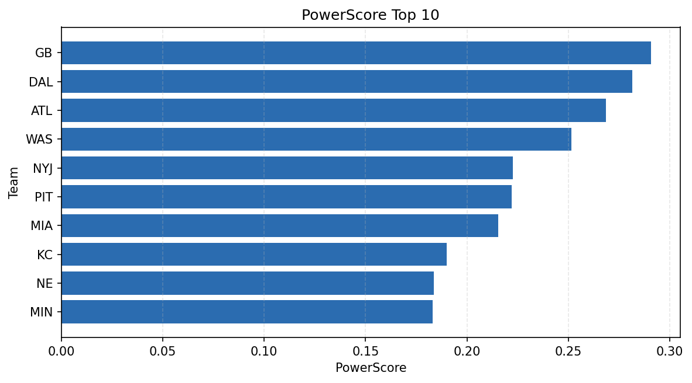

# Weekly Report - Season 2025, Week 4

_Generated at 2025-11-11T13:53:06.081330+00:00 (UTC)_

Data root: `data`

## Layer Shapes

| Layer | Artifact | Manifest | Rows | Columns | Status |
|-------|----------|----------|------|---------|--------|
| L1 Ingest | `data\l1\2025\4.parquet` | `data\l1\2025\4_manifest.json` | 2761 | 18 | ready |
| L2 Clean | `data\l2\2025\4.parquet` | `data\l2\2025\4_manifest.json` | 2761 | 24 | ready |
| L3 Team Week | `data\l3_team_week\2025\4.parquet` | `data\l3_team_week\2025\4_manifest.json` | 32 | 34 | ready |

## L2 Audit Snapshot

Last 3 entries from `data\l2_audit\2025\4_audit.jsonl`:

- {"step": "load", "details": "Loaded L1 parquet", "rows": 2761, "cols": 18, "timestamp": "2025-11-11T13:53:05.669528+00:00"}
- {"step": "prepare", "details": "Normalized team aliases, filtered season/week, deduplicated keys", "rows": 2761, "cols": 24, "rows_removed": 0, "timestamp": "2025-11-11T13:53:05.669528+00:00"}
- {"step": "validate", "details": "Validated against L2 contract and guardrails", "rows": 2761, "cols": 24, "timestamp": "2025-11-11T13:53:05.669528+00:00"}

## L3 Sanity

- Rows processed: 32
- Columns available: 34
- Artifact path: `data\l3_team_week\2025\4.parquet`

## Metrics Snapshot

### L4 Core12 Preview

- Artifact: `data\l4_core12\2025\4.parquet`
- Manifest: `data\l4_core12\2025\4_manifest.json`
- Rows: 32
- Columns: 15

| TEAM | core_epa_off | core_sr_off | core_sr_def |
| --- | --- | --- | --- |
| NE | 0.24640026739375157 | 0.42424242424242425 | 0.47126436781609193 |
| GB | 0.24406399031480153 | 0.5238095238095238 | 0.5222222222222223 |
| DAL | 0.22845727754498107 | 0.5222222222222223 | 0.5238095238095238 |
| ATL | 0.20668628886120305 | 0.5357142857142857 | 0.5405405405405406 |
| KC | 0.1823907378129661 | 0.4659090909090909 | 0.49295774647887325 |

### PowerScore Rankings

- Artifact: `data\l4_powerscore\2025\4.parquet`
- Manifest: `data\l4_powerscore\2025\4_manifest.json`
- Rows: 32
- Columns: 4

| team | power_score |
| --- | --- |
| GB | 0.29063766164298627 |
| DAL | 0.2815506229814814 |
| ATL | 0.26845876264736174 |
| WAS | 0.25152109182898813 |
| NYJ | 0.22271222132303006 |
| PIT | 0.22199263178274184 |
| MIA | 0.21535967763742653 |
| KC | 0.18992442976669666 |
| NE | 0.18378504963237463 |
| MIN | 0.18294052562451074 |

## Visualizations

