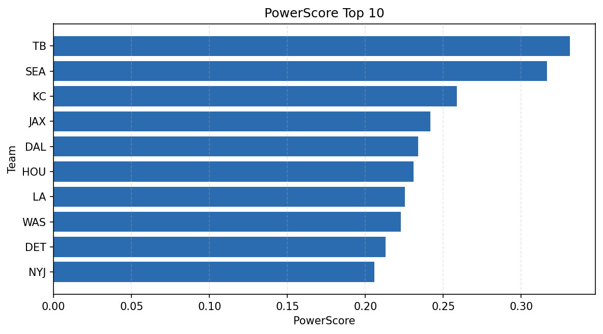

# Weekly Report - Season 2025, Week 5

_Generated at 2025-11-11T13:53:15.715380+00:00 (UTC)_

Data root: `data`

## Layer Shapes

| Layer | Artifact | Manifest | Rows | Columns | Status |
|-------|----------|----------|------|---------|--------|
| L1 Ingest | `data\l1\2025\5.parquet` | `data\l1\2025\5_manifest.json` | 2454 | 18 | ready |
| L2 Clean | `data\l2\2025\5.parquet` | `data\l2\2025\5_manifest.json` | 2454 | 24 | ready |
| L3 Team Week | `data\l3_team_week\2025\5.parquet` | `data\l3_team_week\2025\5_manifest.json` | 28 | 34 | ready |

## L2 Audit Snapshot

Last 3 entries from `data\l2_audit\2025\5_audit.jsonl`:

- {"step": "load", "details": "Loaded L1 parquet", "rows": 2454, "cols": 18, "timestamp": "2025-11-11T13:53:15.196516+00:00"}
- {"step": "prepare", "details": "Normalized team aliases, filtered season/week, deduplicated keys", "rows": 2454, "cols": 24, "rows_removed": 0, "timestamp": "2025-11-11T13:53:15.196516+00:00"}
- {"step": "validate", "details": "Validated against L2 contract and guardrails", "rows": 2454, "cols": 24, "timestamp": "2025-11-11T13:53:15.196516+00:00"}

## L3 Sanity

- Rows processed: 28
- Columns available: 34
- Artifact path: `data\l3_team_week\2025\5.parquet`

## Metrics Snapshot

### L4 Core12 Preview

- Artifact: `data\l4_core12\2025\5.parquet`
- Manifest: `data\l4_core12\2025\5_manifest.json`
- Rows: 32
- Columns: 27

| TEAM | core_epa_off | core_sr_off | core_sr_def |
| --- | --- | --- | --- |
| TB | 0.33884341191304357 | 0.5394736842105263 | 0.5714285714285714 |
| HOU | 0.31254115817958816 | 0.611764705882353 | 0.43548387096774194 |
| DAL | 0.25794387863176627 | 0.47560975609756095 | 0.5 |
| SEA | 0.24349613059554007 | 0.5714285714285714 | 0.5394736842105263 |
| IND | 0.2424103805422783 | 0.5066666666666667 | 0.5 |

### PowerScore Rankings

- Artifact: `data\l4_powerscore\2025\5.parquet`
- Manifest: `data\l4_powerscore\2025\5_manifest.json`
- Rows: 28
- Columns: 4

| team | power_score |
| --- | --- |
| TB | 0.3311102097623575 |
| SEA | 0.31662869172741137 |
| KC | 0.2587410729518504 |
| JAX | 0.24176770926201538 |
| DAL | 0.23378492346021978 |
| HOU | 0.2310578405996608 |
| LA | 0.22530546610286598 |
| WAS | 0.22277521561400332 |
| DET | 0.21305176262569145 |
| NYJ | 0.20590431962898964 |

## Visualizations

