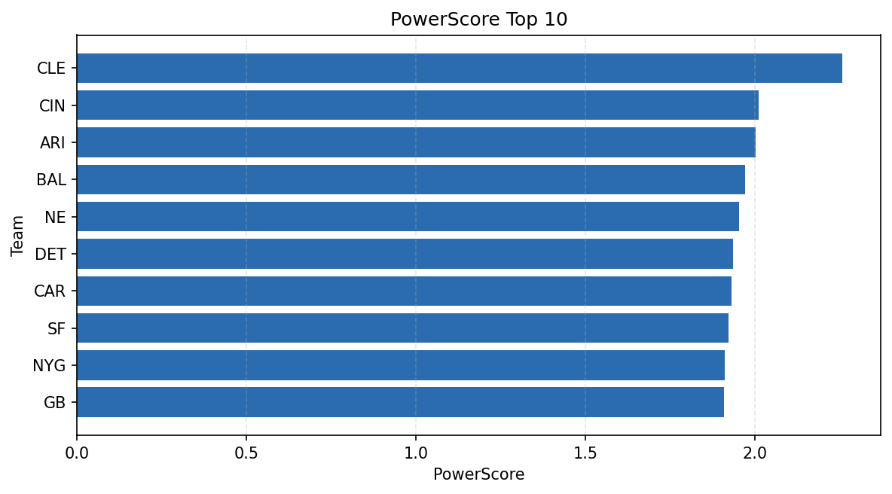

# Weekly Report - Season 2025, Week 6

_Generated at 2026-01-08T19:13:54.704779+00:00 (UTC)_

Data root: `data`

## Layer Shapes

| Layer | Artifact | Manifest | Rows | Columns | Status |
|-------|----------|----------|------|---------|--------|
| L1 Ingest | `data\l1\2025\6.parquet` | `data\l1\2025\6_manifest.json` | 2523 | 18 | ready |
| L2 Clean | `data\l2\2025\6.parquet` | `data\l2\2025\6_manifest.json` | 2523 | 24 | ready |
| L3 Team Week | `data\l3_team_week\2025\6.parquet` | `data\l3_team_week\2025\6_manifest.json` | 30 | 34 | ready |

## L2 Audit Snapshot

Last 3 entries from `data\l2_audit\2025\6_audit.jsonl`:

- {"step": "load", "details": "Loaded L1 parquet", "rows": 2523, "cols": 18, "timestamp": "2026-01-08T19:13:54.330870+00:00"}
- {"step": "prepare", "details": "Normalized team aliases, filtered season/week, deduplicated keys", "rows": 2523, "cols": 24, "rows_removed": 0, "timestamp": "2026-01-08T19:13:54.330870+00:00"}
- {"step": "validate", "details": "Validated against L2 contract and guardrails", "rows": 2523, "cols": 24, "timestamp": "2026-01-08T19:13:54.330870+00:00"}

## L3 Sanity

- Rows processed: 30
- Columns available: 34
- Artifact path: `data\l3_team_week\2025\6.parquet`

## Metrics Snapshot

### L4 Core12 Preview

- Artifact: `data\l4_core12\2025\6.parquet`
- Manifest: `data\l4_core12\2025\6_manifest.json`
- Rows: 30
- Columns: 27

| TEAM | core_epa_off | core_sr_off | core_sr_def |
| --- | --- | --- | --- |
| KC | 0.22661310429374376 | 0.56 | 0.5652173913043478 |
| GB | 0.21622707940638064 | 0.5866666666666667 | 0.5308641975308642 |
| DAL | 0.17656728941054173 | 0.4520547945205479 | 0.5647058823529412 |
| NYG | 0.17047508703758832 | 0.47126436781609193 | 0.5070422535211268 |
| IND | 0.16437398524660812 | 0.5657894736842105 | 0.5111111111111111 |

### PowerScore Rankings

- Artifact: `data\l4_powerscore\2025\6.parquet`
- Manifest: `data\l4_powerscore\2025\6_manifest.json`
- Rows: 30
- Columns: 4

| team | power_score |
| --- | --- |
| CLE | 2.2584212017001937 |
| CIN | 2.0097256171369673 |
| ARI | 2.0017408155025205 |
| BAL | 1.9700848505779296 |
| NE | 1.9536955308331796 |
| DET | 1.935055886125516 |
| CAR | 1.9299381710002692 |
| SF | 1.9218121808985578 |
| NYG | 1.911013345586187 |
| GB | 1.9083066121958383 |

## Visualizations

