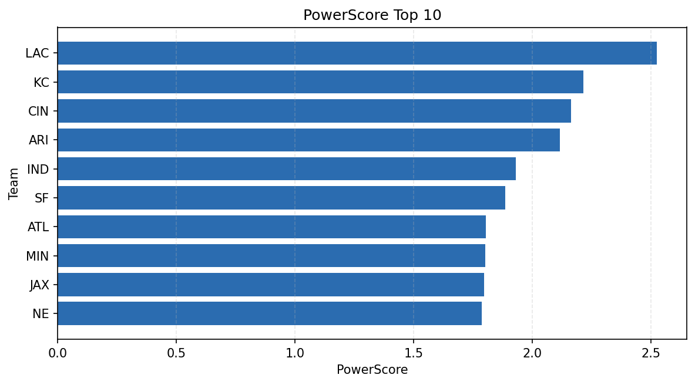

# Weekly Report - Season 2025, Week 7

_Generated at 2025-11-10T14:26:14.691766+00:00 (UTC)_

Data root: `data`

## Layer Shapes

| Layer | Artifact | Manifest | Rows | Columns | Status |
|-------|----------|----------|------|---------|--------|
| L1 Ingest | `data\l1\2025\7.parquet` | `data\l1\2025\7_manifest.json` | 2614 | 18 | ready |
| L2 Clean | `data\l2\2025\7.parquet` | `data\l2\2025\7_manifest.json` | 2614 | 24 | ready |
| L3 Team Week | `data\l3_team_week\2025\7.parquet` | `data\l3_team_week\2025\7_manifest.json` | 30 | 34 | ready |

## L2 Audit Snapshot

Last 3 entries from `data\l2_audit\2025\7_audit.jsonl`:

- {"step": "load", "details": "Loaded L1 parquet", "rows": 2614, "cols": 18, "timestamp": "2025-11-10T14:26:14.284074+00:00"}
- {"step": "prepare", "details": "Normalized team aliases, filtered season/week, deduplicated keys", "rows": 2614, "cols": 24, "rows_removed": 0, "timestamp": "2025-11-10T14:26:14.284074+00:00"}
- {"step": "validate", "details": "Validated against L2 contract and guardrails", "rows": 2614, "cols": 24, "timestamp": "2025-11-10T14:26:14.284074+00:00"}

## L3 Sanity

- Rows processed: 30
- Columns available: 34
- Artifact path: `data\l3_team_week\2025\7.parquet`

## Metrics Snapshot

### L4 Core12 Preview

- Artifact: `data\l4_core12\2025\7.parquet`
- Manifest: `data\l4_core12\2025\7_manifest.json`
- Rows: 30
- Columns: 15

| TEAM | core_epa_off | core_sr_off | core_sr_def |
| --- | --- | --- | --- |
| IND | 0.3671692300688576 | 0.5540540540540541 | 0.4782608695652174 |
| PIT | 0.26228544445708396 | 0.5466666666666666 | 0.5368421052631579 |
| LA | 0.24519463220675444 | 0.5172413793103449 | 0.45652173913043476 |
| CIN | 0.21908684763077058 | 0.5368421052631579 | 0.5466666666666666 |
| KC | 0.19428311674756574 | 0.5 | 0.3333333333333333 |

### PowerScore Rankings

- Artifact: `data\l4_powerscore\2025\7.parquet`
- Manifest: `data\l4_powerscore\2025\7_manifest.json`
- Rows: 30
- Columns: 4

| team | power_score |
| --- | --- |
| IND | 0.3119991114518477 |
| PIT | 0.2989506084194668 |
| CIN | 0.29071643293060756 |
| LAC | 0.24832345256094898 |
| GB | 0.2063340087305258 |
| LA | 0.2060382397789536 |
| DEN | 0.1980837299563982 |
| NYG | 0.1872624214822317 |
| DAL | 0.18031481126484444 |
| ARI | 0.17637944255058408 |

## Visualizations

