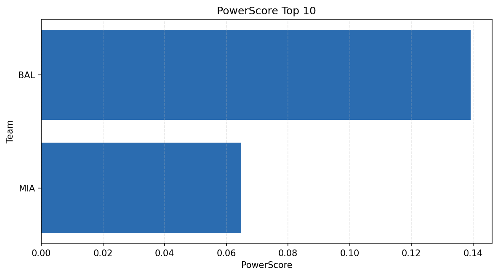

# Weekly Report - Season 2025, Week 9

_Generated at 2025-11-03T14:40:50.794110+00:00 (UTC)_

Data root: `data`

## Layer Shapes

| Layer | Artifact | Manifest | Rows | Columns | Status |
|-------|----------|----------|------|---------|--------|
| L1 Ingest | `data\l1\2025\9.parquet` | `data\l1\2025\9_manifest.json` | 2214 | 18 | ready |
| L2 Clean | `data\l2\2025\9.parquet` | `data\l2\2025\9_manifest.json` | 2214 | 23 | ready |
| L3 Team Week | `data\l3_team_week\2025\9.parquet` | `data\l3_team_week\2025\9_manifest.json` | 26 | 21 | ready |

## L2 Audit Snapshot

Last 3 entries from `data\l2_audit\2025\9_audit.jsonl`:

- {"step": "load", "details": "Loaded L1 parquet", "rows": 2214, "cols": 18, "timestamp": "2025-11-03T14:40:50.446457+00:00"}
- {"step": "prepare", "details": "Normalized team aliases, filtered season/week, deduplicated keys", "rows": 2214, "cols": 23, "rows_removed": 0, "timestamp": "2025-11-03T14:40:50.446457+00:00"}
- {"step": "validate", "details": "Validated against L2 contract and guardrails", "rows": 2214, "cols": 23, "timestamp": "2025-11-03T14:40:50.446457+00:00"}

## L3 Sanity

- Rows processed: 26
- Columns available: 21
- Artifact path: `data\l3_team_week\2025\9.parquet`

## Metrics Snapshot

### L4 Core12 Preview

- Artifact: `data\l4_core12\2025\9.parquet`
- Manifest: `data\l4_core12\2025\9_manifest.json`
- Rows: 2
- Columns: 15

| TEAM | core_epa_off | core_sr_off | core_sr_def |
| --- | --- | --- | --- |
| SEA | 0.3334855174359221 | 0.6 | 0.4878048780487805 |
| CHI | 0.30640623176141696 | 0.5588235294117647 | 0.5568181818181818 |
| SF | 0.27939457879457846 | 0.5301204819277109 | 0.5454545454545454 |
| CIN | 0.24712779783559116 | 0.5568181818181818 | 0.5588235294117647 |
| LA | 0.17170099496919042 | 0.53125 | 0.4074074074074074 |

### PowerScore Rankings

- Artifact: `data\l4_powerscore\2025\9.parquet`
- Manifest: `data\l4_powerscore\2025\9_manifest.json`
- Rows: 26
- Columns: 4

| team | power_score |
| --- | --- |
| CHI | 0.3257853877424377 |
| CIN | 0.31879870286746753 |
| SEA | 0.28106168014476146 |
| SF | 0.2786401583107389 |
| NYG | 0.25119961742183844 |
| JAX | 0.24892175850857776 |
| LV | 0.2433634713289752 |
| BUF | 0.23671547340297974 |
| KC | 0.19568337803515992 |
| LA | 0.1736448757789158 |

## Visualizations

