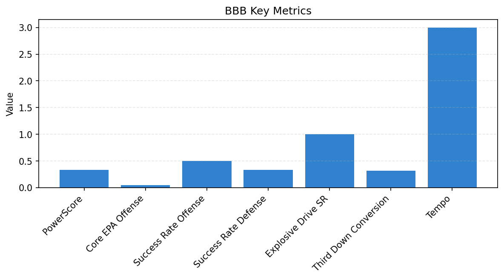

# Team Report - BBB

Season 2025, Week 8

_Generated at 2025-10-28T16:08:09.417844+00:00 (UTC)_
## Snapshot

- PowerScore: 0.329
- Tempo: 3.000

## Core12 Metrics

| Metric | Value |
| --- | --- |
| Core EPA Offense | 0.050 |
| Core EPA Defense | -0.067 |
| Success Rate Offense | 0.500 |
| Success Rate Defense | 0.333 |
| Explosive Drive SR | 1.000 |
| Third Down Conversion | 0.320 |

## Visualizations

