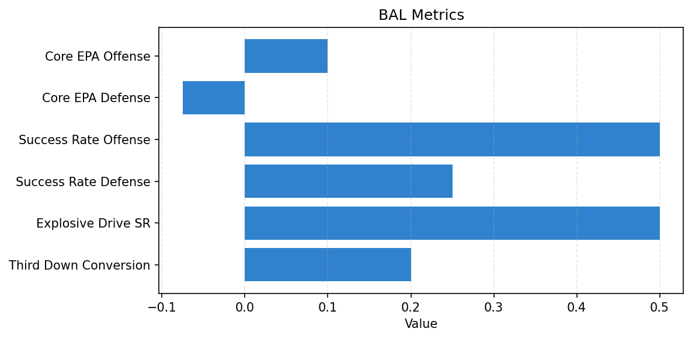

# Team Report - BAL

Season 2025, Week 9

_Generated at 2025-10-29T13:45:08.917583+00:00 (UTC)_
## Snapshot

- PowerScore: 0.245
- Tempo: 2.000

## Core12 Metrics

| Metric | Value |
| --- | --- |
| Core EPA Offense | 0.100 |
| Core EPA Defense | -0.075 |
| Success Rate Offense | 0.500 |
| Success Rate Defense | 0.250 |
| Explosive Drive SR | 0.500 |
| Third Down Conversion | 0.200 |

## Visualizations

