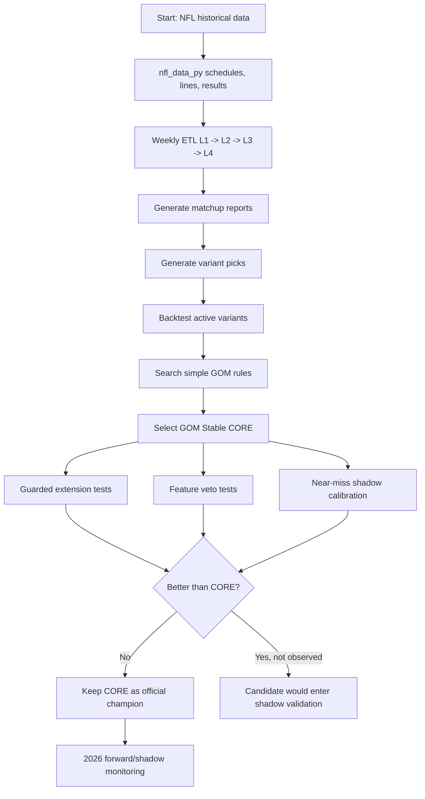
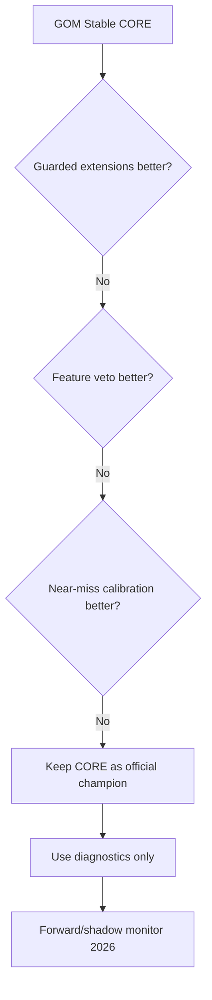

# GOM Research Process

Ten dokument opisuje, jak doszliśmy do aktualnego championa `GOM Stable CORE`,
jakie testy wykonaliśmy i dlaczego obecnie nie promujemy żadnych dodatków.

## Current Champion

`GOM Stable CORE`

```yaml
variant: variant_d_balanced
tag: GOM
confidence_min: 85
edge_min: 4
start_week: 3
max_abs_handicap: 7
handicap_mode: any
staking:
  risk: 3.0u
  win: 2.7u
  loss: -3.0u
  push: 0.0u
```

Backtest 2017-2025:

| Bets | W-L-P | Profit | ROI | Worst Season | Max Drawdown |
|---:|---:|---:|---:|---:|---:|
| 74 | 61-12-1 | +128.7u | 58.0% | +2.1u | -6.3u |

## High-Level Flow



## Detailed Process

### 1. Data Sync

Primary NFL data source:

- `nfl_data_py.import_schedules`
- local schedule parquet: `data/schedules/<season>.parquet`
- lines YAML: `config/lines/<season>/weekX_lines.yaml`

What we use:

- schedule,
- home/away teams,
- spread,
- total,
- final scores,
- game type,
- week.

Important convention:

- project lines use `home_team_spread`,
- `nfl_data_py.spread_line` is treated as away-team spread,
- exporter converts it into home-team spread.

### 2. Weekly Metrics Pipeline

The standard NFL pipeline builds:

```text
L1 raw data
  -> L2 cleaned plays
  -> L3 team-week metrics
  -> L4 Core12 / PowerScore
  -> matchup reports
  -> pick variants
```

Relevant commands:

```powershell
.venv\Scripts\python.exe -m app.cli sync-nfl-schedule --season 2026
.venv\Scripts\python.exe -m app.cli export-lines-from-nfl --season 2026 --week 1
.venv\Scripts\python.exe -m app.cli weekly-pipeline --season 2025 --week 18
```

### 3. Variant Pick Generation

The system produces several variant pick directories:

```text
data/picks_variant_b_edge_focus
data/picks_variant_c_psdiff
data/picks_variant_d_balanced
data/picks_variant_j
data/picks_variant_k
data/picks_variant_m
```

Each pick contains fields such as:

```json
{
  "season": 2025,
  "week": 3,
  "home": "BUF",
  "away": "MIA",
  "tag": "GOM",
  "model_winner": "BUF",
  "confidence": 95.0,
  "model_margin": 27.58,
  "edge_vs_line": 15.08,
  "handicap": -12.5,
  "total": 50.5
}
```

### 4. Baseline Variant Backtests

First broad test: active variants from 2018-2025.

Key observation:

- old broad variants were weak or negative in 2018-2021,
- 2022-2025 looked very strong,
- this raised overfitting/regime-shift risk.

Because of that, we moved from broad variant betting to stricter rule search.

### 5. Strategy Search

Initial search focused on simple, interpretable filters:

- variant,
- tag set,
- confidence threshold,
- edge threshold,
- handicap mode,
- later: start week and spread cap.

The strongest stable family was:

```text
variant_d_balanced or variant_m
tag = GOM
confidence >= 85
edge >= 0/4
```

Then tuning showed the most stable version:

```text
variant_d_balanced
tag = GOM
confidence >= 85
edge >= 4
week >= 3
abs(handicap) <= 7
```

This became `GOM Stable CORE`.

### 6. CORE Result

Season breakdown:

| Season | Bets | W-L-P | Units | ROI |
|---:|---:|---:|---:|---:|
| 2017 | 7 | 7-0-0 | +18.9u | 90.0% |
| 2018 | 4 | 3-1-0 | +5.1u | 42.5% |
| 2019 | 8 | 5-3-0 | +4.5u | 18.8% |
| 2020 | 11 | 7-4-0 | +6.9u | 20.9% |
| 2021 | 5 | 3-2-0 | +2.1u | 14.0% |
| 2022 | 7 | 6-1-0 | +13.2u | 62.9% |
| 2023 | 10 | 9-0-1 | +24.3u | 81.0% |
| 2024 | 11 | 10-1-0 | +24.0u | 72.7% |
| 2025 | 11 | 11-0-0 | +29.7u | 90.0% |

### 7. Staking / Unit Calculation

For GOM:

```text
WIN  = +2.7u
LOSS = -3.0u
PUSH =  0.0u
```

For `61-12-1`:

```text
61 * 2.7u - 12 * 3.0u = +128.7u
```

Risk:

```text
74 bets * 3.0u = 222.0u
```

ROI:

```text
+128.7u / 222.0u = 58.0%
```

## Tests After CORE

### 8. Guarded Extensions

Goal:

- keep all CORE picks,
- add only carefully guarded extra picks.

Tested examples:

| Rule | Bets | W-L-P | Profit | ROI | Max DD | Decision |
|---|---:|---:|---:|---:|---:|---|
| CORE | 74 | 61-12-1 | +128.7u | 58.0% | -6.3u | champion |
| `core_plus_cap8_edge5` | 81 | 65-15-1 | +130.5u | 53.7% | -9.3u | reject |
| `core_plus_cap8_conf90` | 82 | 65-16-1 | +127.5u | 51.8% | -9.3u | reject |
| `core_plus_week2_edge6` | 75 | 62-12-1 | +131.4u | 58.4% | -6.3u | too small |

Conclusion:

- `week2_edge6` improved numbers but added only one pick,
- cap8 variants increased volatility and reduced ROI,
- no extension was strong enough to replace CORE.

### 9. Weather / Bucket System

We also compared `Vortex/Cyclone` style buckets.

Observation:

- weather bucket systems had more volume,
- but 2018 and 2019 were weak,
- using `Vortex/Cyclone` as confirmation for CORE reduced sample size without improving quality.

Conclusion:

- weather buckets can remain as diagnostics,
- not part of official GOM champion.

### 10. Feature Veto Tests

We implemented no-leakage feature diagnostics:

- `early_down_matchup_edge`
- `off_early_down_success_edge`
- `def_early_down_epa_allowed_edge`
- `fumble_recovery_luck_edge`
- `third_down_luck_support`
- `red_zone_luck_support`
- `pressure_matchup_disadvantage`
- `sack_conversion_overperformance`

The test idea:

- remove risky picks,
- compare result after veto against CORE.

Result:

| Veto | Removed W-L-P | After Profit | After ROI | Decision |
|---|---:|---:|---:|---|
| early-down low-third | 22-2-0 | +75.3u | 50.2% | reject |
| off success low-third | 23-4-0 | +78.6u | 55.7% | reject |
| def EPA low-third | 18-2-0 | +86.1u | 53.1% | reject |
| fumble luck >= 0.20 | 3-0-0 | +120.6u | 56.6% | reject |
| third-down luck >= 0.12 | 1-1-0 | +129.0u | 59.7% | reject |
| pressure disadvantage >= 0.08 | 0-0-0 | +128.7u | 58.0% | no signal |

Conclusion:

- hard veto did not improve CORE,
- many diagnostics removed mostly winners,
- GOM appears to capture contrarian market spots that can look bad in classical stats.

### 11. Near-Miss Shadow Calibration

We then tested whether features could find extra GOM picks outside CORE.

Near-miss pool:

```text
variant D
tag = GOM
week >= 3
abs(handicap) <= 8
outside CORE
confidence 80-84 with edge >= 3
or edge 3-4 with confidence >= 80
or cap8 extension
```

Shadow score used:

- confidence,
- edge,
- variant consensus count,
- variant margin dispersion,
- pressure matchup disadvantage,
- third-down luck support,
- model residual bias,
- residual volatility.

Result:

| Strategy | Bets | W-L-P | Profit | ROI | Max DD | Decision |
|---|---:|---:|---:|---:|---:|---|
| CORE | 74 | 61-12-1 | +128.7u | 58.0% | -6.3u | champion |
| Near-miss only | 16 | 9-7-0 | +3.3u | 6.9% | -12.3u | weak pool |
| CORE + top shadow additions | 80 | 63-16-1 | +122.1u | 50.9% | -9.3u | reject |
| CORE + wider additions | 84 | 66-17-1 | +127.2u | 50.5% | -6.6u | reject |

Conclusion:

- near-miss additions are not ready,
- shadow model worsened CORE,
- CORE remains official champion.

## Final Decision



Final status:

```text
Official champion: GOM Stable CORE
Production rule: unchanged
Feature diagnostics: allowed
Hard veto: rejected
Near-miss additions: rejected
Shadow calibration: research only
```

## Commands

Generate fixed strategy report:

```powershell
.venv\Scripts\python.exe -m app.cli strategy-report --strategy config/strategy_rules/gom_stable_edge.yaml --start-season 2017 --end-season 2025 --output data/results/strategy_search/gom_stable_edge_report.md
```

Generate feature veto report:

```powershell
@'
from metrics.ats_features import write_gom_feature_veto_report
print(write_gom_feature_veto_report())
'@ | .venv\Scripts\python.exe -X utf8 -
```

Generate calibration shadow report:

```powershell
.venv\Scripts\python.exe -m app.cli gom-calibration-shadow
```

## Practical Rules Going Forward

- Do not change CORE based on in-sample improvements.
- Do not use early-down weakness as veto.
- Do not add near-miss picks unless a frozen rule proves itself forward.
- Use diagnostics to explain risk, not to override the champion.
- Track 2026 in shadow mode before promoting any new layer.
