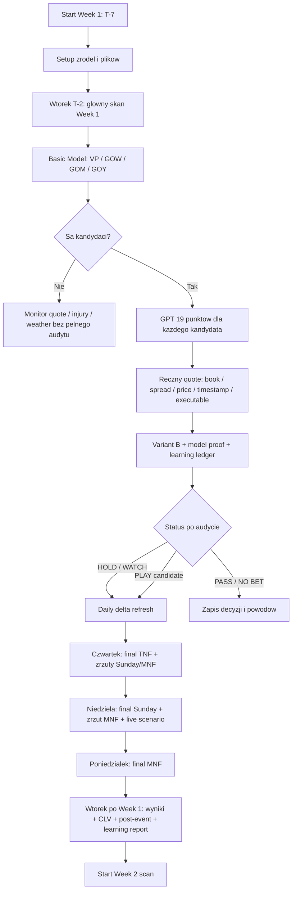
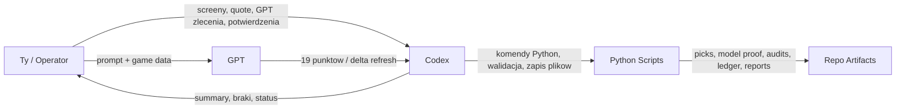

# Week 1 Pregame Workflow Diagram

Ten dokument pokazuje, jak wyglada nasz proces dla Week 1 od tygodnia przed pierwszym kickoffem do zamkniecia kolejki.

Zalozenie:

```text
pierwszy mecz Week 1 jest w czwartek
Week 1 nie ma poprzedniej kolejki do zamkniecia
od Week 2 wtorek zaczynamy od zamkniecia poprzedniej kolejki, a dopiero potem skanujemy nowa
```

## 1. Glowny Diagram



## 2. Kto Co Robi



Podzial odpowiedzialnosci:

```text
Ty:
- robisz screeny / wpisujesz quote
- zlecasz GPT 19 punktow i delta refresh
- potwierdzasz realny quote i executable status
- podejmujesz finalna decyzje operatora

Codex / Python:
- pobiera schedule
- przygotowuje linie
- odpala basic model
- filtruje VP/GOW/GOM/GOY
- generuje model proof
- odpala Variant B
- zapisuje learning ledger
- po meczu robi post-event evaluation i learning report

GPT:
- robi research 19 punktow
- robi delta refresh
- nie liczy finalnego EV
- nie rekonstruuje brakujacych quote
- nie promuje modelu
```

## 3. Kalendarz Week 1

### T-7 Czwartek Przed Week 1

Cel:

```text
techniczne przygotowanie procesu
```

Robimy:

```text
1. Sprawdzamy, czy dziala repo i venv.
2. Sprawdzamy, czy mamy aktualne prompty GPT.
3. Sprawdzamy, czy jest folder na quote i research.
4. Sprawdzamy, czy pregame.com pokazuje pierwsze linie.
5. Nie podejmujemy jeszcze finalnych decyzji.
```

Artefakty:

```text
docs/variant_b_final_gpt_research_prompt.md
docs/variant_b_gpt_short_wrapper.md
WHAT_TO_DO_BEFORE_2026.md
```

### T-6 Piatek Przed Week 1

Cel:

```text
pierwszy lekki market watch
```

Robimy:

```text
1. Jesli sa linie, robimy pierwszy screen z pregame.com.
2. Nie traktujemy tego jako finalny quote.
3. Sprawdzamy duze roster/injury/news, ale bez pelnego audytu.
```

Status:

```text
WATCH_ONLY
```

### T-5 Sobota Przed Week 1

Cel:

```text
utrzymac gotowosc, bez nadmiernej pracy
```

Robimy:

```text
1. Sprawdzamy, czy nie ma duzych newsow.
2. Nie robimy pelnego GPT 19 punktow, jesli basic model nie wskazal jeszcze kandydata.
3. Nie zapisujemy decyzji jako finalnej.
```

### T-4 Niedziela Przed Week 1

Cel:

```text
lekki przeglad rynku i newsow
```

Robimy:

```text
1. Sprawdzamy, czy linie znaczaco sie nie przesunely.
2. Jesli jest duzy ruch, zapisujemy go jako observation, nie jako pick.
3. Czekamy na wtorkowy glowny skan.
```

### T-3 Poniedzialek Przed Week 1

Cel:

```text
przygotowanie do wtorkowego skanu
```

Robimy:

```text
1. Sprawdzamy, czy schedule Week 1 jest dostepny.
2. Sprawdzamy, czy quote workflow jest gotowy.
3. Przygotowujemy prompt do GPT dla screenshotow pregame.com.
```

### T-2 Wtorek Przed Week 1 - Glowny Skan

Cel:

```text
znalezc kandydatow VP/GOW/GOM/GOY
```

Komendy:

```powershell
.\.venv\Scripts\python.exe -m app.cli sync-nfl-schedule --season 2026
.\.venv\Scripts\python.exe -m app.cli export-lines-from-nfl --season 2026 --week 1
.\.venv\Scripts\python.exe scripts\prospective_week_flow.py --season 2026 --week 1 --variant variant_m --skip-freeze
```

Sprawdzamy:

```text
data/picks_variant_m/2026/week_01.jsonl
```

Jesli sa:

```text
VALUE PLAY
GOW
GOM
GOY
```

to dla kazdego kandydata:

```text
1. robimy / aktualizujemy quote snapshot
2. wysylamy GPT pelne 19 punktow
3. wklejamy wynik GPT do Codex
4. odpalamy Variant B
```

Komenda Variant B:

```powershell
.\.venv\Scripts\python.exe scripts\variant_b_week_flow.py --season 2026 --week 1 --variant variant_m --with-model-proof --write-learning-ledger
```

Wynik:

```text
research/variant_b_week_flow/2026/week_01/summary.md
data/learning_ledger/2026/week_01/
```

### T-1 Sroda Przed TNF

Cel:

```text
delta refresh pod TNF i pierwsze zmiany dla Sunday/MNF
```

Robimy:

```text
1. Aktualizujemy quote dla TNF.
2. Sprawdzamy line movement.
3. Sprawdzamy injury / roster / weather.
4. Jesli TNF jest kandydatem, zlecamy GPT delta refresh.
5. Wklejamy wynik do Codex.
6. Odpalamy Variant B ponownie.
```

Statusy:

```text
READY_FOR_TNF_FINAL
WATCH
HOLD
NO BET
```

### T-0 Czwartek - Pierwszy Kickoff

Cel:

```text
ostatni zrzut TNF oraz zrzuty dla Sunday/MNF
```

Dla TNF:

```text
1. Final quote.
2. Final injury/inactives, jesli sa dostepne.
3. Weather.
4. No-chase.
5. Variant B final check.
6. Final operator decision.
```

Dla Sunday/MNF:

```text
1. Zrzut quote.
2. Line movement od wtorku.
3. Injury / roster / weather update.
4. GPT delta refresh, jesli cos istotnego sie zmienilo.
5. Variant B refresh dla kandydatow.
```

### T+1 Piatek

Cel:

```text
glowny refresh Sunday/MNF
```

Robimy:

```text
1. Aktualizujemy quote dla niedzielnych kandydatow.
2. Aktualizujemy quote dla MNF, jesli jest kandydatem.
3. Sprawdzamy injury_role_notes.
4. Sprawdzamy roster_change_check.
5. Sprawdzamy weather.
6. GPT delta refresh dla kandydatow.
7. Variant B refresh.
```

### T+2 Sobota

Cel:

```text
pre-final Sunday/MNF
```

Robimy:

```text
1. Aktualizujemy quote.
2. Sprawdzamy key number movement.
3. Sprawdzamy nowe injury/roster/weather.
4. Tworzymy liste brakow na niedziele.
5. Tworzymy liste brakow na MNF.
6. Oznaczamy statusy.
```

Statusy:

```text
READY_FOR_SUNDAY_CHECK
READY_FOR_MNF_CHECK
WATCH
HOLD
NO BET
```

### T+3 Niedziela

Cel:

```text
ostatni zrzut niedzieli, zrzut MNF i live scenario
```

Dla niedzielnych meczow:

```text
1. Final quote.
2. Final inactives.
3. Weather.
4. No-chase.
5. Variant B final check.
6. Final operator decision.
```

Dla MNF:

```text
1. Aktualizujemy quote.
2. Sprawdzamy line movement.
3. Sprawdzamy injury / roster / weather.
4. GPT delta refresh, jesli MNF jest kandydatem.
5. Variant B refresh.
```

Podczas meczow:

```text
Live Scenario tylko pomocniczo
kurs live wpisujemy recznie
decyzje live zapisujemy oddzielnie od pregame tracking
```

### T+4 Poniedzialek

Cel:

```text
ostatni zrzut MNF
```

Robimy:

```text
1. Final quote dla MNF.
2. Final injury/inactives.
3. Weather.
4. No-chase.
5. GPT final delta refresh, jesli MNF jest kandydatem.
6. Variant B final check.
7. Final operator decision.
```

### T+5 Wtorek Po Week 1

Cel:

```text
zamknac Week 1 i rozpoczac Week 2
```

Najpierw zamykamy Week 1:

```powershell
.\.venv\Scripts\python.exe -m app.cli sync-nfl-results --season 2026
.\.venv\Scripts\python.exe scripts\variant_b_post_event_evaluation.py --season 2026 --week 1
.\.venv\Scripts\python.exe scripts\variant_b_learning_report.py
```

Sprawdzamy:

```text
outcomes
COVER / PUSH / LOSS
closing line / closing price, jesli mamy
CLV
process failures
learning report
```

Dopiero potem zaczynamy Week 2:

```text
schedule
linie
basic model
VP/GOW/GOM/GOY
GPT 19 punktow
quote
Variant B
```

## 4. Artefakty

Najwazniejsze pliki i foldery:

```text
config/lines/2026/week1_lines.yaml
data/book_snapshots/2026/week_01_screen_snapshot.yaml
data/market_quotes/2026/week_01.jsonl
data/picks_variant_m/2026/week_01.jsonl
research/variant_b_week_flow/2026/week_01/summary.md
research/variant_b_week_flow/2026/week_01/*.json
data/learning_ledger/2026/week_01/
research/variant_b_learning_report.md
```

## 5. Najprostsza Wersja Operacyjna

```text
T-2 wtorek:
basic model -> kandydaci -> GPT 19 punktow -> quote -> Variant B

T-1 sroda:
TNF delta

T-0 czwartek:
final TNF + zrzut Sunday/MNF

T+1 piatek:
refresh Sunday/MNF

T+2 sobota:
pre-final Sunday/MNF

T+3 niedziela:
final Sunday + zrzut MNF + live

T+4 poniedzialek:
final MNF

T+5 wtorek:
zamkniecie Week 1 + start Week 2
```

